# Домашнее задание к занятию 10 «Jenkins»

## Подготовка к выполнению

1. Создать два VM: для jenkins-master и jenkins-agent.

Создал два ВМ:

  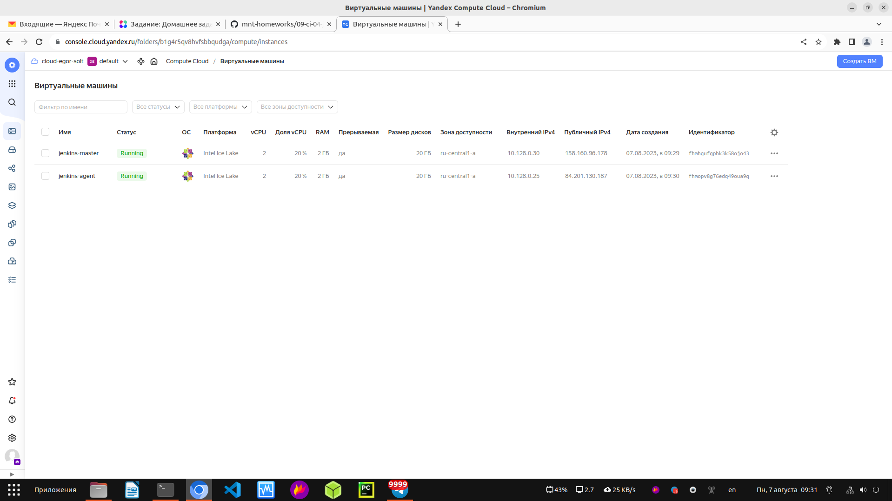

2. Установить Jenkins при помощи playbook.

Установил Jenkins при помощи playbook:

  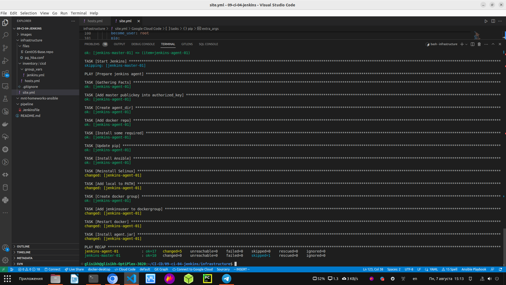

3. Запустить и проверить работоспособность.

  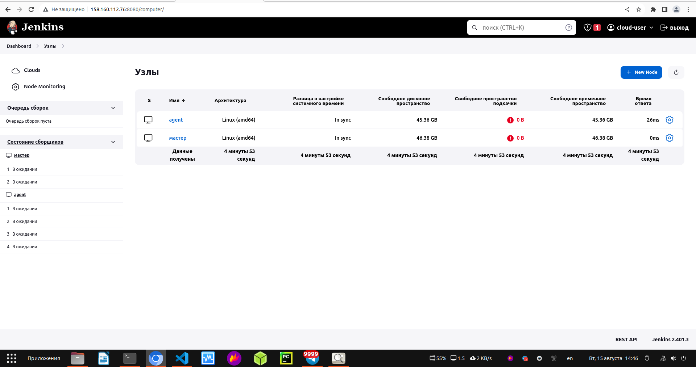

4. Сделать первоначальную настройку.

Сделал первоначальную настройку:

  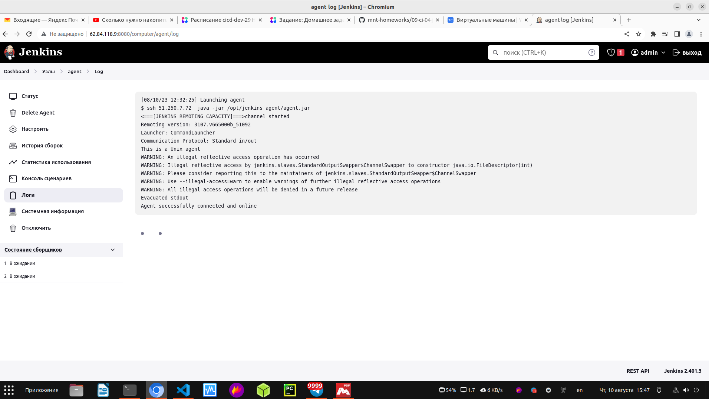

## Основная часть

1. Сделать Freestyle Job, который будет запускать `molecule test` из любого вашего репозитория с ролью.

Freestyle Job

Started by user cloud-user
Running as SYSTEM
Building remotely on agent (linux ansible) in workspace /opt/jenkins_agent/workspace/vector-role
The recommended git tool is: NONE
using credential 0e814440-356b-4a1a-bb9c-484cc57e3532
 > git rev-parse --resolve-git-dir /opt/jenkins_agent/workspace/vector-role/.git # timeout=10
Fetching changes from the remote Git repository
 > git config remote.origin.url https://github.com/george25031996/vector-role.git # timeout=10
Fetching upstream changes from https://github.com/george25031996/vector-role.git
 > git --version # timeout=10
 > git --version # 'git version 2.39.3'
using GIT_SSH to set credentials 
[INFO] Currently running in a labeled security context
[INFO] Currently SELinux is 'enforcing' on the host
 > /usr/bin/chcon --type=ssh_home_t /opt/jenkins_agent/workspace/vector-role@tmp/jenkins-gitclient-ssh2919395019108200958.key
Verifying host key using known hosts file, will automatically accept unseen keys
 > git fetch --tags --force --progress -- https://github.com/george25031996/vector-role.git +refs/heads/*:refs/remotes/origin/* # timeout=10
 > git rev-parse refs/remotes/origin/main^{commit} # timeout=10
Checking out Revision 0fe3332090b7858c9e0921aa039419d24dfc1e45 (refs/remotes/origin/main)
 > git config core.sparsecheckout # timeout=10
 > git checkout -f 0fe3332090b7858c9e0921aa039419d24dfc1e45 # timeout=10
Commit message: "11111111111111"
 > git rev-list --no-walk 1dc78e4bafde0e6c80275572fb2eb5d5da4b1ede # timeout=10
[vector-role] $ /bin/sh -xe /tmp/jenkins14356600553812591287.sh
+ molecule --version
/usr/local/lib/python3.6/site-packages/requests/__init__.py:104: RequestsDependencyWarning: urllib3 (1.26.16) or chardet (5.0.0)/charset_normalizer (2.0.12) doesn't match a supported version!
  RequestsDependencyWarning)
[DEPRECATION WARNING]: Ansible will require Python 3.8 or newer on the 
controller starting with Ansible 2.12. Current version: 3.6.8 (default, Jun 26 
2023, 20:26:30) [GCC 8.5.0 20210514 (Red Hat 8.5.0-20)]. This feature will be 
removed from ansible-core in version 2.12. Deprecation warnings can be disabled
 by setting deprecation_warnings=False in ansible.cfg.
/usr/local/lib/python3.6/site-packages/ansible/parsing/vault/__init__.py:44: CryptographyDeprecationWarning: Python 3.6 is no longer supported by the Python core team. Therefore, support for it is deprecated in cryptography. The next release of cryptography will remove support for Python 3.6.
  from cryptography.exceptions import InvalidSignature
molecule 3.5.2 using python 3.6 
    ansible:2.11.12
    delegated:3.5.2 from molecule
    docker:1.1.0 from molecule_docker requiring collections: community.docker>=1.9.1
+ molecule test -s centos7
/usr/local/lib/python3.6/site-packages/requests/__init__.py:104: RequestsDependencyWarning: urllib3 (1.26.16) or chardet (5.0.0)/charset_normalizer (2.0.12) doesn't match a supported version!
  RequestsDependencyWarning)
[DEPRECATION WARNING]: Ansible will require Python 3.8 or newer on the 
controller starting with Ansible 2.12. Current version: 3.6.8 (default, Jun 26 
2023, 20:26:30) [GCC 8.5.0 20210514 (Red Hat 8.5.0-20)]. This feature will be 
removed from ansible-core in version 2.12. Deprecation warnings can be disabled
 by setting deprecation_warnings=False in ansible.cfg.
/usr/local/lib/python3.6/site-packages/ansible/parsing/vault/__init__.py:44: CryptographyDeprecationWarning: Python 3.6 is no longer supported by the Python core team. Therefore, support for it is deprecated in cryptography. The next release of cryptography will remove support for Python 3.6.
  from cryptography.exceptions import InvalidSignature
INFO     centos7 scenario test matrix: dependency, lint, cleanup, destroy, syntax, create, prepare, converge, idempotence, side_effect, verify, cleanup, destroy
INFO     Performing prerun...
INFO     Set ANSIBLE_LIBRARY=/home/jenkins/.cache/ansible-compat/8cb146/modules:/home/jenkins/.ansible/plugins/modules:/usr/share/ansible/plugins/modules
INFO     Set ANSIBLE_COLLECTIONS_PATH=/home/jenkins/.cache/ansible-compat/8cb146/collections:/home/jenkins/.ansible/collections:/usr/share/ansible/collections
INFO     Set ANSIBLE_ROLES_PATH=/home/jenkins/.cache/ansible-compat/8cb146/roles:/home/jenkins/.ansible/roles:/usr/share/ansible/roles:/etc/ansible/roles
INFO     Running centos7 > dependency
WARNING  Skipping, missing the requirements file.
WARNING  Skipping, missing the requirements file.
INFO     Running centos7 > lint
INFO     Lint is disabled.
INFO     Running centos7 > cleanup
WARNING  Skipping, cleanup playbook not configured.
INFO     Running centos7 > destroy
INFO     Sanity checks: 'docker'
[DEPRECATION WARNING]: Ansible will require Python 3.8 or newer on the
controller starting with Ansible 2.12. Current version: 3.6.8 (default, Jun 26
2023, 20:26:30) [GCC 8.5.0 20210514 (Red Hat 8.5.0-20)]. This feature will be
removed from ansible-core in version 2.12. Deprecation warnings can be disabled
 by setting deprecation_warnings=False in ansible.cfg.

PLAY [Destroy] *****************************************************************

TASK [Destroy molecule instance(s)] ********************************************
/usr/local/lib/python3.6/site-packages/ansible/parsing/vault/__init__.py:44: CryptographyDeprecationWarning: Python 3.6 is no longer supported by the Python core team. Therefore, support for it is deprecated in cryptography. The next release of cryptography will remove support for Python 3.6.
  from cryptography.exceptions import InvalidSignature
changed: [localhost] => (item=instance)

TASK [Wait for instance(s) deletion to complete] *******************************
FAILED - RETRYING: Wait for instance(s) deletion to complete (300 retries left).
ok: [localhost] => (item=instance)

TASK [Delete docker networks(s)] ***********************************************

PLAY RECAP *********************************************************************
localhost                  : ok=2    changed=1    unreachable=0    failed=0    skipped=1    rescued=0    ignored=0

INFO     Running centos7 > syntax
[DEPRECATION WARNING]: Ansible will require Python 3.8 or newer on the
controller starting with Ansible 2.12. Current version: 3.6.8 (default, Jun 26
2023, 20:26:30) [GCC 8.5.0 20210514 (Red Hat 8.5.0-20)]. This feature will be
removed from ansible-core in version 2.12. Deprecation warnings can be disabled
 by setting deprecation_warnings=False in ansible.cfg.

playbook: /opt/jenkins_agent/workspace/vector-role/molecule/centos7/converge.yml
/usr/local/lib/python3.6/site-packages/ansible/parsing/vault/__init__.py:44: CryptographyDeprecationWarning: Python 3.6 is no longer supported by the Python core team. Therefore, support for it is deprecated in cryptography. The next release of cryptography will remove support for Python 3.6.
  from cryptography.exceptions import InvalidSignature
INFO     Running centos7 > create
[DEPRECATION WARNING]: Ansible will require Python 3.8 or newer on the
controller starting with Ansible 2.12. Current version: 3.6.8 (default, Jun 26
2023, 20:26:30) [GCC 8.5.0 20210514 (Red Hat 8.5.0-20)]. This feature will be
removed from ansible-core in version 2.12. Deprecation warnings can be disabled
 by setting deprecation_warnings=False in ansible.cfg.

PLAY [Create] ******************************************************************

TASK [Log into a Docker registry] **********************************************
/usr/local/lib/python3.6/site-packages/ansible/parsing/vault/__init__.py:44: CryptographyDeprecationWarning: Python 3.6 is no longer supported by the Python core team. Therefore, support for it is deprecated in cryptography. The next release of cryptography will remove support for Python 3.6.
  from cryptography.exceptions import InvalidSignature
skipping: [localhost] => (item=None)
skipping: [localhost]

TASK [Check presence of custom Dockerfiles] ************************************
ok: [localhost] => (item={'image': 'docker.io/pycontribs/centos:7', 'name': 'instance', 'pre_build_image': True})

TASK [Create Dockerfiles from image names] *************************************
skipping: [localhost] => (item={'image': 'docker.io/pycontribs/centos:7', 'name': 'instance', 'pre_build_image': True})

TASK [Discover local Docker images] ********************************************
ok: [localhost] => (item={'changed': False, 'skipped': True, 'skip_reason': 'Conditional result was False', 'item': {'image': 'docker.io/pycontribs/centos:7', 'name': 'instance', 'pre_build_image': True}, 'ansible_loop_var': 'item', 'i': 0, 'ansible_index_var': 'i'})

TASK [Build an Ansible compatible image (new)] *********************************
skipping: [localhost] => (item=molecule_local/docker.io/pycontribs/centos:7)

TASK [Create docker network(s)] ************************************************

TASK [Determine the CMD directives] ********************************************
ok: [localhost] => (item={'image': 'docker.io/pycontribs/centos:7', 'name': 'instance', 'pre_build_image': True})

TASK [Create molecule instance(s)] *********************************************
changed: [localhost] => (item=instance)

TASK [Wait for instance(s) creation to complete] *******************************
FAILED - RETRYING: Wait for instance(s) creation to complete (300 retries left).
changed: [localhost] => (item={'started': 1, 'finished': 0, 'ansible_job_id': '999377583060.30923', 'results_file': '/home/jenkins/.ansible_async/999377583060.30923', 'changed': True, 'failed': False, 'item': {'image': 'docker.io/pycontribs/centos:7', 'name': 'instance', 'pre_build_image': True}, 'ansible_loop_var': 'item'})

PLAY RECAP *********************************************************************
localhost                  : ok=5    changed=2    unreachable=0    failed=0    skipped=4    rescued=0    ignored=0

INFO     Running centos7 > prepare
WARNING  Skipping, prepare playbook not configured.
INFO     Running centos7 > converge
[DEPRECATION WARNING]: Ansible will require Python 3.8 or newer on the
controller starting with Ansible 2.12. Current version: 3.6.8 (default, Jun 26
2023, 20:26:30) [GCC 8.5.0 20210514 (Red Hat 8.5.0-20)]. This feature will be
removed from ansible-core in version 2.12. Deprecation warnings can be disabled
 by setting deprecation_warnings=False in ansible.cfg.

PLAY [Converge] ****************************************************************

TASK [Gathering Facts] *********************************************************
/usr/local/lib/python3.6/site-packages/ansible/parsing/vault/__init__.py:44: CryptographyDeprecationWarning: Python 3.6 is no longer supported by the Python core team. Therefore, support for it is deprecated in cryptography. The next release of cryptography will remove support for Python 3.6.
  from cryptography.exceptions import InvalidSignature
ok: [instance]

TASK [Include vector-role] *****************************************************

TASK [vector-role : Install vector] ********************************************
included: /opt/jenkins_agent/workspace/vector-role/tasks/install_vector_docker.yml for instance

TASK [vector-role : VECTOR | Install rpm] **************************************
changed: [instance]

TASK [vector-role : VECTOR | Template config] **********************************
changed: [instance]

TASK [vector-role : Put docker package on hold] ********************************
ok: [instance]

TASK [vector-role : Install vector] ********************************************
skipping: [instance]

PLAY RECAP *********************************************************************
instance                   : ok=5    changed=2    unreachable=0    failed=0    skipped=1    rescued=0    ignored=0

INFO     Running centos7 > idempotence
[DEPRECATION WARNING]: Ansible will require Python 3.8 or newer on the
controller starting with Ansible 2.12. Current version: 3.6.8 (default, Jun 26
2023, 20:26:30) [GCC 8.5.0 20210514 (Red Hat 8.5.0-20)]. This feature will be
removed from ansible-core in version 2.12. Deprecation warnings can be disabled
 by setting deprecation_warnings=False in ansible.cfg.

PLAY [Converge] ****************************************************************

TASK [Gathering Facts] *********************************************************
/usr/local/lib/python3.6/site-packages/ansible/parsing/vault/__init__.py:44: CryptographyDeprecationWarning: Python 3.6 is no longer supported by the Python core team. Therefore, support for it is deprecated in cryptography. The next release of cryptography will remove support for Python 3.6.
  from cryptography.exceptions import InvalidSignature
ok: [instance]

TASK [Include vector-role] *****************************************************

TASK [vector-role : Install vector] ********************************************
included: /opt/jenkins_agent/workspace/vector-role/tasks/install_vector_docker.yml for instance

TASK [vector-role : VECTOR | Install rpm] **************************************
ok: [instance]

TASK [vector-role : VECTOR | Template config] **********************************
ok: [instance]

TASK [vector-role : Put docker package on hold] ********************************
ok: [instance]

TASK [vector-role : Install vector] ********************************************
skipping: [instance]

PLAY RECAP *********************************************************************
instance                   : ok=5    changed=0    unreachable=0    failed=0    skipped=1    rescued=0    ignored=0

INFO     Idempotence completed successfully.
INFO     Running centos7 > side_effect
WARNING  Skipping, side effect playbook not configured.
INFO     Running centos7 > verify
INFO     Running Ansible Verifier
[DEPRECATION WARNING]: Ansible will require Python 3.8 or newer on the
controller starting with Ansible 2.12. Current version: 3.6.8 (default, Jun 26
2023, 20:26:30) [GCC 8.5.0 20210514 (Red Hat 8.5.0-20)]. This feature will be
removed from ansible-core in version 2.12. Deprecation warnings can be disabled
 by setting deprecation_warnings=False in ansible.cfg.

PLAY [Verify] ******************************************************************

TASK [Example assertion] *******************************************************
/usr/local/lib/python3.6/site-packages/ansible/parsing/vault/__init__.py:44: CryptographyDeprecationWarning: Python 3.6 is no longer supported by the Python core team. Therefore, support for it is deprecated in cryptography. The next release of cryptography will remove support for Python 3.6.
  from cryptography.exceptions import InvalidSignature
ok: [instance] => {
    "changed": false,
    "msg": "All assertions passed"
}

TASK [Check Vector configs] ****************************************************
changed: [instance]

TASK [Check Vector status] *****************************************************
changed: [instance]

PLAY RECAP *********************************************************************
instance                   : ok=3    changed=2    unreachable=0    failed=0    skipped=0    rescued=0    ignored=0

INFO     Verifier completed successfully.
INFO     Running centos7 > cleanup
WARNING  Skipping, cleanup playbook not configured.
INFO     Running centos7 > destroy
[DEPRECATION WARNING]: Ansible will require Python 3.8 or newer on the
controller starting with Ansible 2.12. Current version: 3.6.8 (default, Jun 26
2023, 20:26:30) [GCC 8.5.0 20210514 (Red Hat 8.5.0-20)]. This feature will be
removed from ansible-core in version 2.12. Deprecation warnings can be disabled
 by setting deprecation_warnings=False in ansible.cfg.

PLAY [Destroy] *****************************************************************

TASK [Destroy molecule instance(s)] ********************************************
/usr/local/lib/python3.6/site-packages/ansible/parsing/vault/__init__.py:44: CryptographyDeprecationWarning: Python 3.6 is no longer supported by the Python core team. Therefore, support for it is deprecated in cryptography. The next release of cryptography will remove support for Python 3.6.
  from cryptography.exceptions import InvalidSignature
changed: [localhost] => (item=instance)

TASK [Wait for instance(s) deletion to complete] *******************************
FAILED - RETRYING: Wait for instance(s) deletion to complete (300 retries left).
changed: [localhost] => (item=instance)

TASK [Delete docker networks(s)] ***********************************************

PLAY RECAP *********************************************************************
localhost                  : ok=2    changed=2    unreachable=0    failed=0    skipped=1    rescued=0    ignored=0

INFO     Pruning extra files from scenario ephemeral directory
Finished: SUCCESS

  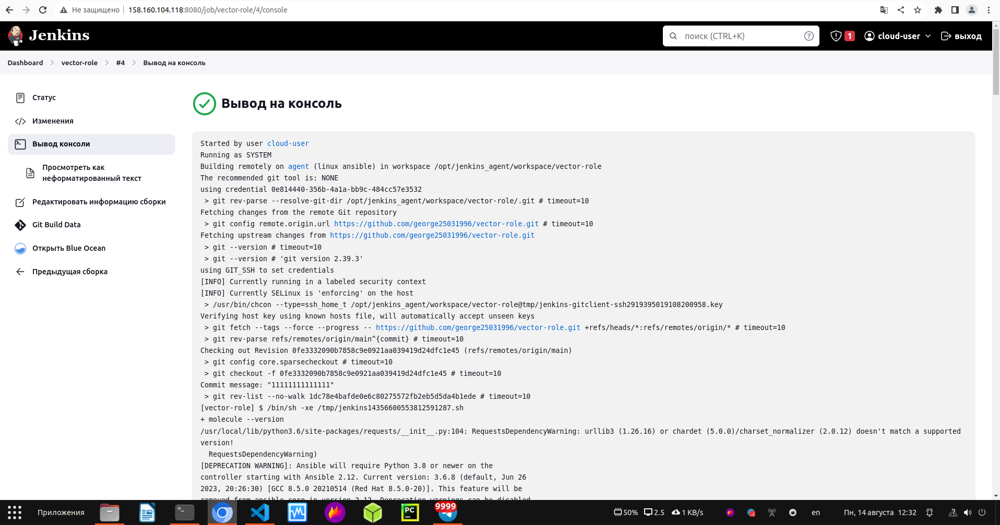

  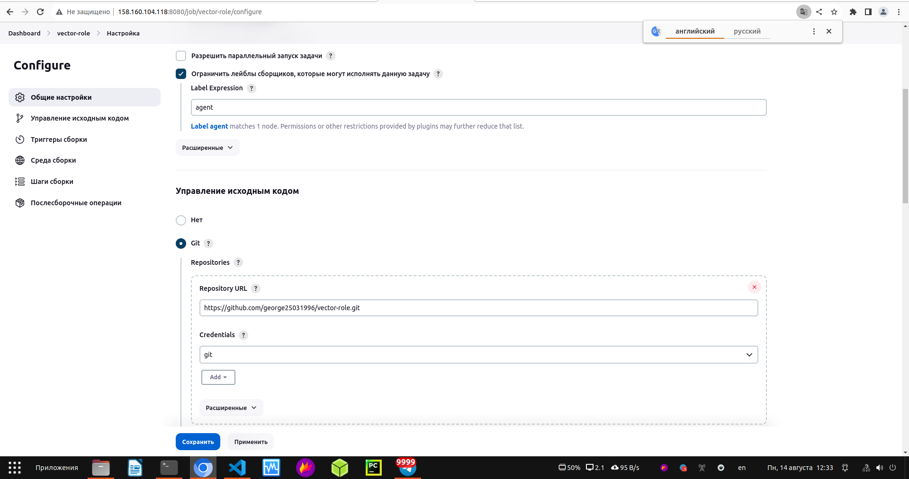

  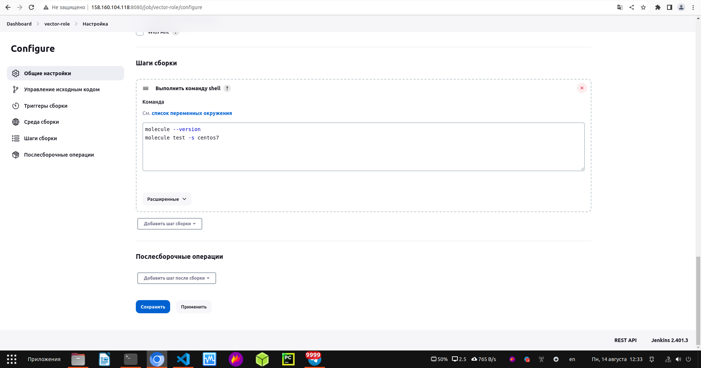

2. Сделать Declarative Pipeline Job, который будет запускать `molecule test` из любого вашего репозитория с ролью.

Declarative Pipeline Job

Started by user cloud-user
[Pipeline] Start of Pipeline
[Pipeline] node
Running on agent in /opt/jenkins_agent/workspace/Pipeline vector-role
[Pipeline] {
[Pipeline] stage
[Pipeline] { (Git)
[Pipeline] git
The recommended git tool is: NONE
No credentials specified
Cloning the remote Git repository
Cloning repository https://github.com/george25031996/vector-role.git
 > git init /opt/jenkins_agent/workspace/Pipeline vector-role # timeout=10
Fetching upstream changes from https://github.com/george25031996/vector-role.git
 > git --version # timeout=10
 > git --version # 'git version 2.39.3'
 > git fetch --tags --force --progress -- https://github.com/george25031996/vector-role.git +refs/heads/*:refs/remotes/origin/* # timeout=10
Avoid second fetch
Checking out Revision 0fe3332090b7858c9e0921aa039419d24dfc1e45 (refs/remotes/origin/main)
Commit message: "11111111111111"
First time build. Skipping changelog.
[Pipeline] }
[Pipeline] // stage
[Pipeline] stage
[Pipeline] { (Molecule install)
 > git config remote.origin.url https://github.com/george25031996/vector-role.git # timeout=10
 > git config --add remote.origin.fetch +refs/heads/*:refs/remotes/origin/* # timeout=10
 > git rev-parse refs/remotes/origin/main^{commit} # timeout=10
 > git config core.sparsecheckout # timeout=10
 > git checkout -f 0fe3332090b7858c9e0921aa039419d24dfc1e45 # timeout=10
 > git branch -a -v --no-abbrev # timeout=10
 > git checkout -b main 0fe3332090b7858c9e0921aa039419d24dfc1e45 # timeout=10
[Pipeline] sh
+ pip install molecule==3.4.0
Defaulting to user installation because normal site-packages is not writeable
Collecting molecule==3.4.0
  Downloading molecule-3.4.0-py3-none-any.whl (239 kB)
Requirement already satisfied: selinux in /usr/local/lib/python3.6/site-packages (from molecule==3.4.0) (0.2.1)
Requirement already satisfied: enrich>=1.2.5 in /usr/local/lib/python3.6/site-packages (from molecule==3.4.0) (1.2.7)
Requirement already satisfied: click<9,>=8.0 in /usr/local/lib/python3.6/site-packages (from molecule==3.4.0) (8.0.4)
Requirement already satisfied: Jinja2>=2.11.3 in /usr/local/lib/python3.6/site-packages (from molecule==3.4.0) (3.0.3)
Requirement already satisfied: click-help-colors>=0.9 in /usr/local/lib/python3.6/site-packages (from molecule==3.4.0) (0.9.1)
Requirement already satisfied: packaging in /usr/local/lib/python3.6/site-packages (from molecule==3.4.0) (21.3)
Requirement already satisfied: paramiko<3,>=2.5.0 in /usr/local/lib/python3.6/site-packages (from molecule==3.4.0) (2.12.0)
Requirement already satisfied: PyYAML<6,>=5.1 in /usr/local/lib64/python3.6/site-packages (from molecule==3.4.0) (5.4.1)
Requirement already satisfied: subprocess-tee>=0.3.2 in /usr/local/lib/python3.6/site-packages (from molecule==3.4.0) (0.3.5)
Collecting ansible-lint>=5.1.1
  Downloading ansible_lint-5.4.0-py3-none-any.whl (119 kB)
Requirement already satisfied: rich>=9.5.1 in /usr/local/lib/python3.6/site-packages (from molecule==3.4.0) (12.6.0)
Requirement already satisfied: dataclasses in /usr/local/lib/python3.6/site-packages (from molecule==3.4.0) (0.8)
Collecting pluggy<1.0,>=0.7.1
  Downloading pluggy-0.13.1-py2.py3-none-any.whl (18 kB)
Requirement already satisfied: cerberus!=1.3.3,!=1.3.4,>=1.3.1 in /usr/local/lib/python3.6/site-packages (from molecule==3.4.0) (1.3.5)
Requirement already satisfied: cookiecutter>=1.7.3 in /usr/local/lib/python3.6/site-packages (from molecule==3.4.0) (1.7.3)
Requirement already satisfied: setuptools>=42 in /usr/local/lib/python3.6/site-packages (from molecule==3.4.0) (59.6.0)
Collecting wcmatch>=7.0
  Downloading wcmatch-8.3-py3-none-any.whl (42 kB)
Collecting ruamel.yaml<1,>=0.15.34
  Downloading ruamel.yaml-0.17.32-py3-none-any.whl (112 kB)
Collecting tenacity
  Downloading tenacity-8.2.2-py3-none-any.whl (24 kB)
Requirement already satisfied: typing-extensions in /usr/local/lib/python3.6/site-packages (from ansible-lint>=5.1.1->molecule==3.4.0) (4.1.1)
Requirement already satisfied: importlib-metadata in /usr/local/lib/python3.6/site-packages (from cerberus!=1.3.3,!=1.3.4,>=1.3.1->molecule==3.4.0) (4.8.3)
Requirement already satisfied: requests>=2.23.0 in /usr/local/lib/python3.6/site-packages (from cookiecutter>=1.7.3->molecule==3.4.0) (2.27.1)
Requirement already satisfied: python-slugify>=4.0.0 in /usr/local/lib/python3.6/site-packages (from cookiecutter>=1.7.3->molecule==3.4.0) (6.1.2)
Requirement already satisfied: poyo>=0.5.0 in /usr/local/lib/python3.6/site-packages (from cookiecutter>=1.7.3->molecule==3.4.0) (0.5.0)
Requirement already satisfied: jinja2-time>=0.2.0 in /usr/local/lib/python3.6/site-packages (from cookiecutter>=1.7.3->molecule==3.4.0) (0.2.0)
Requirement already satisfied: binaryornot>=0.4.4 in /usr/local/lib/python3.6/site-packages (from cookiecutter>=1.7.3->molecule==3.4.0) (0.4.4)
Requirement already satisfied: six>=1.10 in /usr/local/lib/python3.6/site-packages (from cookiecutter>=1.7.3->molecule==3.4.0) (1.16.0)
Requirement already satisfied: MarkupSafe>=2.0 in /usr/local/lib64/python3.6/site-packages (from Jinja2>=2.11.3->molecule==3.4.0) (2.0.1)
Requirement already satisfied: cryptography>=2.5 in /usr/local/lib64/python3.6/site-packages (from paramiko<3,>=2.5.0->molecule==3.4.0) (40.0.2)
Requirement already satisfied: bcrypt>=3.1.3 in /usr/local/lib64/python3.6/site-packages (from paramiko<3,>=2.5.0->molecule==3.4.0) (4.0.1)
Requirement already satisfied: pynacl>=1.0.1 in /usr/local/lib64/python3.6/site-packages (from paramiko<3,>=2.5.0->molecule==3.4.0) (1.5.0)
Requirement already satisfied: pygments<3.0.0,>=2.6.0 in /usr/local/lib/python3.6/site-packages (from rich>=9.5.1->molecule==3.4.0) (2.14.0)
Requirement already satisfied: commonmark<0.10.0,>=0.9.0 in /usr/local/lib/python3.6/site-packages (from rich>=9.5.1->molecule==3.4.0) (0.9.1)
Requirement already satisfied: pyparsing!=3.0.5,>=2.0.2 in /usr/local/lib/python3.6/site-packages (from packaging->molecule==3.4.0) (3.1.1)
Requirement already satisfied: distro>=1.3.0 in /usr/local/lib/python3.6/site-packages (from selinux->molecule==3.4.0) (1.8.0)
Requirement already satisfied: chardet>=3.0.2 in /usr/local/lib/python3.6/site-packages (from binaryornot>=0.4.4->cookiecutter>=1.7.3->molecule==3.4.0) (5.0.0)
Requirement already satisfied: cffi>=1.12 in /usr/local/lib64/python3.6/site-packages (from cryptography>=2.5->paramiko<3,>=2.5.0->molecule==3.4.0) (1.15.1)
Requirement already satisfied: zipp>=0.5 in /usr/local/lib/python3.6/site-packages (from importlib-metadata->cerberus!=1.3.3,!=1.3.4,>=1.3.1->molecule==3.4.0) (3.6.0)
Requirement already satisfied: arrow in /usr/local/lib/python3.6/site-packages (from jinja2-time>=0.2.0->cookiecutter>=1.7.3->molecule==3.4.0) (1.2.3)
Requirement already satisfied: text-unidecode>=1.3 in /usr/local/lib/python3.6/site-packages (from python-slugify>=4.0.0->cookiecutter>=1.7.3->molecule==3.4.0) (1.3)
Requirement already satisfied: certifi>=2017.4.17 in /usr/local/lib/python3.6/site-packages (from requests>=2.23.0->cookiecutter>=1.7.3->molecule==3.4.0) (2023.7.22)
Requirement already satisfied: urllib3<1.27,>=1.21.1 in /usr/local/lib/python3.6/site-packages (from requests>=2.23.0->cookiecutter>=1.7.3->molecule==3.4.0) (1.26.16)
Requirement already satisfied: charset-normalizer~=2.0.0 in /usr/local/lib/python3.6/site-packages (from requests>=2.23.0->cookiecutter>=1.7.3->molecule==3.4.0) (2.0.12)
Requirement already satisfied: idna<4,>=2.5 in /usr/local/lib/python3.6/site-packages (from requests>=2.23.0->cookiecutter>=1.7.3->molecule==3.4.0) (3.4)
Collecting ruamel.yaml.clib>=0.2.7
  Downloading ruamel.yaml.clib-0.2.7-cp36-cp36m-manylinux_2_17_x86_64.manylinux2014_x86_64.manylinux_2_24_x86_64.whl (503 kB)
Collecting bracex>=2.1.1
  Downloading bracex-2.2.1-py3-none-any.whl (12 kB)
Requirement already satisfied: pycparser in /usr/local/lib/python3.6/site-packages (from cffi>=1.12->cryptography>=2.5->paramiko<3,>=2.5.0->molecule==3.4.0) (2.21)
Requirement already satisfied: python-dateutil>=2.7.0 in /usr/local/lib/python3.6/site-packages (from arrow->jinja2-time>=0.2.0->cookiecutter>=1.7.3->molecule==3.4.0) (2.8.2)
Installing collected packages: ruamel.yaml.clib, bracex, wcmatch, tenacity, ruamel.yaml, pluggy, ansible-lint, molecule
Successfully installed ansible-lint-5.4.0 bracex-2.2.1 molecule-3.4.0 pluggy-0.13.1 ruamel.yaml-0.17.32 ruamel.yaml.clib-0.2.7 tenacity-8.2.2 wcmatch-8.3
[Pipeline] sh
+ pip install 'ansible-lint<6.0.0'
Defaulting to user installation because normal site-packages is not writeable
Requirement already satisfied: ansible-lint<6.0.0 in /home/jenkins/.local/lib/python3.6/site-packages (5.4.0)
Requirement already satisfied: enrich>=1.2.6 in /usr/local/lib/python3.6/site-packages (from ansible-lint<6.0.0) (1.2.7)
Requirement already satisfied: rich>=9.5.1 in /usr/local/lib/python3.6/site-packages (from ansible-lint<6.0.0) (12.6.0)
Requirement already satisfied: ruamel.yaml<1,>=0.15.34 in /home/jenkins/.local/lib/python3.6/site-packages (from ansible-lint<6.0.0) (0.17.32)
Requirement already satisfied: wcmatch>=7.0 in /home/jenkins/.local/lib/python3.6/site-packages (from ansible-lint<6.0.0) (8.3)
Requirement already satisfied: packaging in /usr/local/lib/python3.6/site-packages (from ansible-lint<6.0.0) (21.3)
Requirement already satisfied: typing-extensions in /usr/local/lib/python3.6/site-packages (from ansible-lint<6.0.0) (4.1.1)
Requirement already satisfied: pyyaml in /usr/local/lib64/python3.6/site-packages (from ansible-lint<6.0.0) (5.4.1)
Requirement already satisfied: tenacity in /home/jenkins/.local/lib/python3.6/site-packages (from ansible-lint<6.0.0) (8.2.2)
Requirement already satisfied: pygments<3.0.0,>=2.6.0 in /usr/local/lib/python3.6/site-packages (from rich>=9.5.1->ansible-lint<6.0.0) (2.14.0)
Requirement already satisfied: dataclasses<0.9,>=0.7 in /usr/local/lib/python3.6/site-packages (from rich>=9.5.1->ansible-lint<6.0.0) (0.8)
Requirement already satisfied: commonmark<0.10.0,>=0.9.0 in /usr/local/lib/python3.6/site-packages (from rich>=9.5.1->ansible-lint<6.0.0) (0.9.1)
Requirement already satisfied: ruamel.yaml.clib>=0.2.7 in /home/jenkins/.local/lib/python3.6/site-packages (from ruamel.yaml<1,>=0.15.34->ansible-lint<6.0.0) (0.2.7)
Requirement already satisfied: bracex>=2.1.1 in /home/jenkins/.local/lib/python3.6/site-packages (from wcmatch>=7.0->ansible-lint<6.0.0) (2.2.1)
Requirement already satisfied: pyparsing!=3.0.5,>=2.0.2 in /usr/local/lib/python3.6/site-packages (from packaging->ansible-lint<6.0.0) (3.1.1)
[Pipeline] sh
+ pip install molecule_docker
Defaulting to user installation because normal site-packages is not writeable
Requirement already satisfied: molecule_docker in /usr/local/lib/python3.6/site-packages (1.1.0)
Requirement already satisfied: selinux in /usr/local/lib/python3.6/site-packages (from molecule_docker) (0.2.1)
Requirement already satisfied: ansible-compat>=0.5.0 in /usr/local/lib/python3.6/site-packages (from molecule_docker) (1.0.0)
Requirement already satisfied: molecule>=3.4.0 in /home/jenkins/.local/lib/python3.6/site-packages (from molecule_docker) (3.4.0)
Requirement already satisfied: docker>=4.3.1 in /usr/local/lib/python3.6/site-packages (from molecule_docker) (5.0.3)
Requirement already satisfied: requests in /usr/local/lib/python3.6/site-packages (from molecule_docker) (2.27.1)
Requirement already satisfied: subprocess-tee>=0.3.5 in /usr/local/lib/python3.6/site-packages (from ansible-compat>=0.5.0->molecule_docker) (0.3.5)
Requirement already satisfied: cached-property~=1.5 in /usr/local/lib/python3.6/site-packages (from ansible-compat>=0.5.0->molecule_docker) (1.5.2)
Requirement already satisfied: PyYAML in /usr/local/lib64/python3.6/site-packages (from ansible-compat>=0.5.0->molecule_docker) (5.4.1)
Requirement already satisfied: websocket-client>=0.32.0 in /usr/local/lib/python3.6/site-packages (from docker>=4.3.1->molecule_docker) (1.3.1)
Requirement already satisfied: setuptools>=42 in /usr/local/lib/python3.6/site-packages (from molecule>=3.4.0->molecule_docker) (59.6.0)
Requirement already satisfied: cookiecutter>=1.7.3 in /usr/local/lib/python3.6/site-packages (from molecule>=3.4.0->molecule_docker) (1.7.3)
Requirement already satisfied: click<9,>=8.0 in /usr/local/lib/python3.6/site-packages (from molecule>=3.4.0->molecule_docker) (8.0.4)
Requirement already satisfied: pluggy<1.0,>=0.7.1 in /home/jenkins/.local/lib/python3.6/site-packages (from molecule>=3.4.0->molecule_docker) (0.13.1)
Requirement already satisfied: click-help-colors>=0.9 in /usr/local/lib/python3.6/site-packages (from molecule>=3.4.0->molecule_docker) (0.9.1)
Requirement already satisfied: ansible-lint>=5.1.1 in /home/jenkins/.local/lib/python3.6/site-packages (from molecule>=3.4.0->molecule_docker) (5.4.0)
Requirement already satisfied: Jinja2>=2.11.3 in /usr/local/lib/python3.6/site-packages (from molecule>=3.4.0->molecule_docker) (3.0.3)
Requirement already satisfied: enrich>=1.2.5 in /usr/local/lib/python3.6/site-packages (from molecule>=3.4.0->molecule_docker) (1.2.7)
Requirement already satisfied: rich>=9.5.1 in /usr/local/lib/python3.6/site-packages (from molecule>=3.4.0->molecule_docker) (12.6.0)
Requirement already satisfied: dataclasses in /usr/local/lib/python3.6/site-packages (from molecule>=3.4.0->molecule_docker) (0.8)
Requirement already satisfied: cerberus!=1.3.3,!=1.3.4,>=1.3.1 in /usr/local/lib/python3.6/site-packages (from molecule>=3.4.0->molecule_docker) (1.3.5)
Requirement already satisfied: paramiko<3,>=2.5.0 in /usr/local/lib/python3.6/site-packages (from molecule>=3.4.0->molecule_docker) (2.12.0)
Requirement already satisfied: packaging in /usr/local/lib/python3.6/site-packages (from molecule>=3.4.0->molecule_docker) (21.3)
Requirement already satisfied: charset-normalizer~=2.0.0 in /usr/local/lib/python3.6/site-packages (from requests->molecule_docker) (2.0.12)
Requirement already satisfied: idna<4,>=2.5 in /usr/local/lib/python3.6/site-packages (from requests->molecule_docker) (3.4)
Requirement already satisfied: urllib3<1.27,>=1.21.1 in /usr/local/lib/python3.6/site-packages (from requests->molecule_docker) (1.26.16)
Requirement already satisfied: certifi>=2017.4.17 in /usr/local/lib/python3.6/site-packages (from requests->molecule_docker) (2023.7.22)
Requirement already satisfied: distro>=1.3.0 in /usr/local/lib/python3.6/site-packages (from selinux->molecule_docker) (1.8.0)
Requirement already satisfied: typing-extensions in /usr/local/lib/python3.6/site-packages (from ansible-lint>=5.1.1->molecule>=3.4.0->molecule_docker) (4.1.1)
Requirement already satisfied: ruamel.yaml<1,>=0.15.34 in /home/jenkins/.local/lib/python3.6/site-packages (from ansible-lint>=5.1.1->molecule>=3.4.0->molecule_docker) (0.17.32)
Requirement already satisfied: wcmatch>=7.0 in /home/jenkins/.local/lib/python3.6/site-packages (from ansible-lint>=5.1.1->molecule>=3.4.0->molecule_docker) (8.3)
Requirement already satisfied: tenacity in /home/jenkins/.local/lib/python3.6/site-packages (from ansible-lint>=5.1.1->molecule>=3.4.0->molecule_docker) (8.2.2)
Requirement already satisfied: importlib-metadata in /usr/local/lib/python3.6/site-packages (from cerberus!=1.3.3,!=1.3.4,>=1.3.1->molecule>=3.4.0->molecule_docker) (4.8.3)
Requirement already satisfied: poyo>=0.5.0 in /usr/local/lib/python3.6/site-packages (from cookiecutter>=1.7.3->molecule>=3.4.0->molecule_docker) (0.5.0)
Requirement already satisfied: six>=1.10 in /usr/local/lib/python3.6/site-packages (from cookiecutter>=1.7.3->molecule>=3.4.0->molecule_docker) (1.16.0)
Requirement already satisfied: binaryornot>=0.4.4 in /usr/local/lib/python3.6/site-packages (from cookiecutter>=1.7.3->molecule>=3.4.0->molecule_docker) (0.4.4)
Requirement already satisfied: jinja2-time>=0.2.0 in /usr/local/lib/python3.6/site-packages (from cookiecutter>=1.7.3->molecule>=3.4.0->molecule_docker) (0.2.0)
Requirement already satisfied: python-slugify>=4.0.0 in /usr/local/lib/python3.6/site-packages (from cookiecutter>=1.7.3->molecule>=3.4.0->molecule_docker) (6.1.2)
Requirement already satisfied: MarkupSafe>=2.0 in /usr/local/lib64/python3.6/site-packages (from Jinja2>=2.11.3->molecule>=3.4.0->molecule_docker) (2.0.1)
Requirement already satisfied: bcrypt>=3.1.3 in /usr/local/lib64/python3.6/site-packages (from paramiko<3,>=2.5.0->molecule>=3.4.0->molecule_docker) (4.0.1)
Requirement already satisfied: pynacl>=1.0.1 in /usr/local/lib64/python3.6/site-packages (from paramiko<3,>=2.5.0->molecule>=3.4.0->molecule_docker) (1.5.0)
Requirement already satisfied: cryptography>=2.5 in /usr/local/lib64/python3.6/site-packages (from paramiko<3,>=2.5.0->molecule>=3.4.0->molecule_docker) (40.0.2)
Requirement already satisfied: commonmark<0.10.0,>=0.9.0 in /usr/local/lib/python3.6/site-packages (from rich>=9.5.1->molecule>=3.4.0->molecule_docker) (0.9.1)
Requirement already satisfied: pygments<3.0.0,>=2.6.0 in /usr/local/lib/python3.6/site-packages (from rich>=9.5.1->molecule>=3.4.0->molecule_docker) (2.14.0)
Requirement already satisfied: pyparsing!=3.0.5,>=2.0.2 in /usr/local/lib/python3.6/site-packages (from packaging->molecule>=3.4.0->molecule_docker) (3.1.1)
Requirement already satisfied: chardet>=3.0.2 in /usr/local/lib/python3.6/site-packages (from binaryornot>=0.4.4->cookiecutter>=1.7.3->molecule>=3.4.0->molecule_docker) (5.0.0)
Requirement already satisfied: cffi>=1.12 in /usr/local/lib64/python3.6/site-packages (from cryptography>=2.5->paramiko<3,>=2.5.0->molecule>=3.4.0->molecule_docker) (1.15.1)
Requirement already satisfied: zipp>=0.5 in /usr/local/lib/python3.6/site-packages (from importlib-metadata->cerberus!=1.3.3,!=1.3.4,>=1.3.1->molecule>=3.4.0->molecule_docker) (3.6.0)
Requirement already satisfied: arrow in /usr/local/lib/python3.6/site-packages (from jinja2-time>=0.2.0->cookiecutter>=1.7.3->molecule>=3.4.0->molecule_docker) (1.2.3)
Requirement already satisfied: text-unidecode>=1.3 in /usr/local/lib/python3.6/site-packages (from python-slugify>=4.0.0->cookiecutter>=1.7.3->molecule>=3.4.0->molecule_docker) (1.3)
Requirement already satisfied: ruamel.yaml.clib>=0.2.7 in /home/jenkins/.local/lib/python3.6/site-packages (from ruamel.yaml<1,>=0.15.34->ansible-lint>=5.1.1->molecule>=3.4.0->molecule_docker) (0.2.7)
Requirement already satisfied: bracex>=2.1.1 in /home/jenkins/.local/lib/python3.6/site-packages (from wcmatch>=7.0->ansible-lint>=5.1.1->molecule>=3.4.0->molecule_docker) (2.2.1)
Requirement already satisfied: pycparser in /usr/local/lib/python3.6/site-packages (from cffi>=1.12->cryptography>=2.5->paramiko<3,>=2.5.0->molecule>=3.4.0->molecule_docker) (2.21)
Requirement already satisfied: python-dateutil>=2.7.0 in /usr/local/lib/python3.6/site-packages (from arrow->jinja2-time>=0.2.0->cookiecutter>=1.7.3->molecule>=3.4.0->molecule_docker) (2.8.2)
[Pipeline] }
[Pipeline] // stage
[Pipeline] stage
[Pipeline] { (Molecule test)
[Pipeline] sh
+ molecule test -s centos7
/usr/local/lib/python3.6/site-packages/requests/__init__.py:104: RequestsDependencyWarning: urllib3 (1.26.16) or chardet (5.0.0)/charset_normalizer (2.0.12) doesn't match a supported version!
  RequestsDependencyWarning)
INFO     centos7 scenario test matrix: dependency, lint, cleanup, destroy, syntax, create, prepare, converge, idempotence, side_effect, verify, cleanup, destroy
INFO     Performing prerun...
INFO     Guessed /opt/jenkins_agent/workspace/Pipeline vector-role as project root directory
INFO     Running ansible-galaxy role install --force --roles-path /home/jenkins/.cache/ansible-lint/efb085/roles -vr molecule/centos7/requirements.yml
WARNING  Computed fully qualified role name of Pipeline vector-role does not follow current galaxy requirements.
Please edit meta/main.yml and assure we can correctly determine full role name:

galaxy_info:
role_name: my_name  # if absent directory name hosting role is used instead
namespace: my_galaxy_namespace  # if absent, author is used instead

Namespace: https://galaxy.ansible.com/docs/contributing/namespaces.html#galaxy-namespace-limitations
Role: https://galaxy.ansible.com/docs/contributing/creating_role.html#role-names

As an alternative, you can add 'role-name' to either skip_list or warn_list.

INFO     Using /home/jenkins/.cache/ansible-lint/efb085/roles/Pipeline vector-role symlink to current repository in order to enable Ansible to find the role using its expected full name.
INFO     Added ANSIBLE_ROLES_PATH=~/.ansible/roles:/usr/share/ansible/roles:/etc/ansible/roles:/home/jenkins/.cache/ansible-lint/efb085/roles
INFO     Running centos7 > dependency
[DEPRECATION WARNING]: Ansible will require Python 3.8 or newer on the 
controller starting with Ansible 2.12. Current version: 3.6.8 (default, Jun 26 
2023, 20:26:30) [GCC 8.5.0 20210514 (Red Hat 8.5.0-20)]. This feature will be 
removed from ansible-core in version 2.12. Deprecation warnings can be disabled
 by setting deprecation_warnings=False in ansible.cfg.
/usr/local/lib/python3.6/site-packages/ansible/parsing/vault/__init__.py:44: CryptographyDeprecationWarning: Python 3.6 is no longer supported by the Python core team. Therefore, support for it is deprecated in cryptography. The next release of cryptography will remove support for Python 3.6.
  from cryptography.exceptions import InvalidSignature
INFO     Running ansible-galaxy collection install --force -v community.docker:>=1.9.1
[DEPRECATION WARNING]: Ansible will require Python 3.8 or newer on the 
controller starting with Ansible 2.12. Current version: 3.6.8 (default, Jun 26 
2023, 20:26:30) [GCC 8.5.0 20210514 (Red Hat 8.5.0-20)]. This feature will be 
removed from ansible-core in version 2.12. Deprecation warnings can be disabled
 by setting deprecation_warnings=False in ansible.cfg.
/usr/local/lib/python3.6/site-packages/ansible/parsing/vault/__init__.py:44: CryptographyDeprecationWarning: Python 3.6 is no longer supported by the Python core team. Therefore, support for it is deprecated in cryptography. The next release of cryptography will remove support for Python 3.6.
  from cryptography.exceptions import InvalidSignature
WARNING  Skipping, missing the requirements file.
[DEPRECATION WARNING]: Ansible will require Python 3.8 or newer on the 
controller starting with Ansible 2.12. Current version: 3.6.8 (default, Jun 26 
2023, 20:26:30) [GCC 8.5.0 20210514 (Red Hat 8.5.0-20)]. This feature will be 
removed from ansible-core in version 2.12. Deprecation warnings can be disabled
 by setting deprecation_warnings=False in ansible.cfg.
/usr/local/lib/python3.6/site-packages/ansible/parsing/vault/__init__.py:44: CryptographyDeprecationWarning: Python 3.6 is no longer supported by the Python core team. Therefore, support for it is deprecated in cryptography. The next release of cryptography will remove support for Python 3.6.
  from cryptography.exceptions import InvalidSignature
WARNING  Skipping, missing the requirements file.
INFO     Running centos7 > lint
INFO     Lint is disabled.
INFO     Running centos7 > cleanup
WARNING  Skipping, cleanup playbook not configured.
INFO     Running centos7 > destroy
INFO     Sanity checks: 'docker'
/usr/local/lib/python3.6/site-packages/paramiko/transport.py:33: CryptographyDeprecationWarning: Python 3.6 is no longer supported by the Python core team. Therefore, support for it is deprecated in cryptography. The next release of cryptography will remove support for Python 3.6.
  from cryptography.hazmat.backends import default_backend
[DEPRECATION WARNING]: Ansible will require Python 3.8 or newer on the
controller starting with Ansible 2.12. Current version: 3.6.8 (default, Jun 26
2023, 20:26:30) [GCC 8.5.0 20210514 (Red Hat 8.5.0-20)]. This feature will be
removed from ansible-core in version 2.12. Deprecation warnings can be disabled
 by setting deprecation_warnings=False in ansible.cfg.

PLAY [Destroy] *****************************************************************

TASK [Destroy molecule instance(s)] ********************************************
/usr/local/lib/python3.6/site-packages/ansible/parsing/vault/__init__.py:44: CryptographyDeprecationWarning: Python 3.6 is no longer supported by the Python core team. Therefore, support for it is deprecated in cryptography. The next release of cryptography will remove support for Python 3.6.
  from cryptography.exceptions import InvalidSignature
changed: [localhost] => (item=instance)

TASK [Wait for instance(s) deletion to complete] *******************************
FAILED - RETRYING: Wait for instance(s) deletion to complete (300 retries left).
ok: [localhost] => (item=instance)

TASK [Delete docker networks(s)] ***********************************************

PLAY RECAP *********************************************************************
localhost                  : ok=2    changed=1    unreachable=0    failed=0    skipped=1    rescued=0    ignored=0

INFO     Running centos7 > syntax
[DEPRECATION WARNING]: Ansible will require Python 3.8 or newer on the
controller starting with Ansible 2.12. Current version: 3.6.8 (default, Jun 26
2023, 20:26:30) [GCC 8.5.0 20210514 (Red Hat 8.5.0-20)]. This feature will be
removed from ansible-core in version 2.12. Deprecation warnings can be disabled
 by setting deprecation_warnings=False in ansible.cfg.

playbook: /opt/jenkins_agent/workspace/Pipeline vector-role/molecule/centos7/converge.yml
/usr/local/lib/python3.6/site-packages/ansible/parsing/vault/__init__.py:44: CryptographyDeprecationWarning: Python 3.6 is no longer supported by the Python core team. Therefore, support for it is deprecated in cryptography. The next release of cryptography will remove support for Python 3.6.
  from cryptography.exceptions import InvalidSignature
INFO     Running centos7 > create
[DEPRECATION WARNING]: Ansible will require Python 3.8 or newer on the
controller starting with Ansible 2.12. Current version: 3.6.8 (default, Jun 26
2023, 20:26:30) [GCC 8.5.0 20210514 (Red Hat 8.5.0-20)]. This feature will be
removed from ansible-core in version 2.12. Deprecation warnings can be disabled
 by setting deprecation_warnings=False in ansible.cfg.

PLAY [Create] ******************************************************************

TASK [Log into a Docker registry] **********************************************
/usr/local/lib/python3.6/site-packages/ansible/parsing/vault/__init__.py:44: CryptographyDeprecationWarning: Python 3.6 is no longer supported by the Python core team. Therefore, support for it is deprecated in cryptography. The next release of cryptography will remove support for Python 3.6.
  from cryptography.exceptions import InvalidSignature
skipping: [localhost] => (item=None)
skipping: [localhost]

TASK [Check presence of custom Dockerfiles] ************************************
ok: [localhost] => (item={'image': 'docker.io/pycontribs/centos:7', 'name': 'instance', 'pre_build_image': True})

TASK [Create Dockerfiles from image names] *************************************
skipping: [localhost] => (item={'image': 'docker.io/pycontribs/centos:7', 'name': 'instance', 'pre_build_image': True})

TASK [Discover local Docker images] ********************************************
ok: [localhost] => (item={'changed': False, 'skipped': True, 'skip_reason': 'Conditional result was False', 'item': {'image': 'docker.io/pycontribs/centos:7', 'name': 'instance', 'pre_build_image': True}, 'ansible_loop_var': 'item', 'i': 0, 'ansible_index_var': 'i'})

TASK [Build an Ansible compatible image (new)] *********************************
skipping: [localhost] => (item=molecule_local/docker.io/pycontribs/centos:7)

TASK [Create docker network(s)] ************************************************

TASK [Determine the CMD directives] ********************************************
ok: [localhost] => (item={'image': 'docker.io/pycontribs/centos:7', 'name': 'instance', 'pre_build_image': True})

TASK [Create molecule instance(s)] *********************************************
changed: [localhost] => (item=instance)

TASK [Wait for instance(s) creation to complete] *******************************
FAILED - RETRYING: Wait for instance(s) creation to complete (300 retries left).
changed: [localhost] => (item={'started': 1, 'finished': 0, 'ansible_job_id': '167369630415.34302', 'results_file': '/home/jenkins/.ansible_async/167369630415.34302', 'changed': True, 'failed': False, 'item': {'image': 'docker.io/pycontribs/centos:7', 'name': 'instance', 'pre_build_image': True}, 'ansible_loop_var': 'item'})

PLAY RECAP *********************************************************************
localhost                  : ok=5    changed=2    unreachable=0    failed=0    skipped=4    rescued=0    ignored=0

INFO     Running centos7 > prepare
WARNING  Skipping, prepare playbook not configured.
INFO     Running centos7 > converge
[DEPRECATION WARNING]: Ansible will require Python 3.8 or newer on the
controller starting with Ansible 2.12. Current version: 3.6.8 (default, Jun 26
2023, 20:26:30) [GCC 8.5.0 20210514 (Red Hat 8.5.0-20)]. This feature will be
removed from ansible-core in version 2.12. Deprecation warnings can be disabled
 by setting deprecation_warnings=False in ansible.cfg.

PLAY [Converge] ****************************************************************

TASK [Gathering Facts] *********************************************************
/usr/local/lib/python3.6/site-packages/ansible/parsing/vault/__init__.py:44: CryptographyDeprecationWarning: Python 3.6 is no longer supported by the Python core team. Therefore, support for it is deprecated in cryptography. The next release of cryptography will remove support for Python 3.6.
  from cryptography.exceptions import InvalidSignature
ok: [instance]

TASK [Include vector-role] *****************************************************

TASK [vector-role : Install vector] ********************************************
included: /opt/jenkins_agent/workspace/vector-role/tasks/install_vector_docker.yml for instance

TASK [vector-role : VECTOR | Install rpm] **************************************
changed: [instance]

TASK [vector-role : VECTOR | Template config] **********************************
changed: [instance]

TASK [vector-role : Put docker package on hold] ********************************
ok: [instance]

TASK [vector-role : Install vector] ********************************************
skipping: [instance]

PLAY RECAP *********************************************************************
instance                   : ok=5    changed=2    unreachable=0    failed=0    skipped=1    rescued=0    ignored=0

INFO     Running centos7 > idempotence
[DEPRECATION WARNING]: Ansible will require Python 3.8 or newer on the
controller starting with Ansible 2.12. Current version: 3.6.8 (default, Jun 26
2023, 20:26:30) [GCC 8.5.0 20210514 (Red Hat 8.5.0-20)]. This feature will be
removed from ansible-core in version 2.12. Deprecation warnings can be disabled
 by setting deprecation_warnings=False in ansible.cfg.

PLAY [Converge] ****************************************************************

TASK [Gathering Facts] *********************************************************
/usr/local/lib/python3.6/site-packages/ansible/parsing/vault/__init__.py:44: CryptographyDeprecationWarning: Python 3.6 is no longer supported by the Python core team. Therefore, support for it is deprecated in cryptography. The next release of cryptography will remove support for Python 3.6.
  from cryptography.exceptions import InvalidSignature
ok: [instance]

TASK [Include vector-role] *****************************************************

TASK [vector-role : Install vector] ********************************************
included: /opt/jenkins_agent/workspace/vector-role/tasks/install_vector_docker.yml for instance

TASK [vector-role : VECTOR | Install rpm] **************************************
ok: [instance]

TASK [vector-role : VECTOR | Template config] **********************************
ok: [instance]

TASK [vector-role : Put docker package on hold] ********************************
ok: [instance]

TASK [vector-role : Install vector] ********************************************
skipping: [instance]

PLAY RECAP *********************************************************************
instance                   : ok=5    changed=0    unreachable=0    failed=0    skipped=1    rescued=0    ignored=0

INFO     Idempotence completed successfully.
INFO     Running centos7 > side_effect
WARNING  Skipping, side effect playbook not configured.
INFO     Running centos7 > verify
INFO     Running Ansible Verifier
[DEPRECATION WARNING]: Ansible will require Python 3.8 or newer on the
controller starting with Ansible 2.12. Current version: 3.6.8 (default, Jun 26
2023, 20:26:30) [GCC 8.5.0 20210514 (Red Hat 8.5.0-20)]. This feature will be
removed from ansible-core in version 2.12. Deprecation warnings can be disabled
 by setting deprecation_warnings=False in ansible.cfg.

PLAY [Verify] ******************************************************************

TASK [Example assertion] *******************************************************
/usr/local/lib/python3.6/site-packages/ansible/parsing/vault/__init__.py:44: CryptographyDeprecationWarning: Python 3.6 is no longer supported by the Python core team. Therefore, support for it is deprecated in cryptography. The next release of cryptography will remove support for Python 3.6.
  from cryptography.exceptions import InvalidSignature
ok: [instance] => {
    "changed": false,
    "msg": "All assertions passed"
}

TASK [Check Vector configs] ****************************************************
changed: [instance]

TASK [Check Vector status] *****************************************************
changed: [instance]

PLAY RECAP *********************************************************************
instance                   : ok=3    changed=2    unreachable=0    failed=0    skipped=0    rescued=0    ignored=0

INFO     Verifier completed successfully.
INFO     Running centos7 > cleanup
WARNING  Skipping, cleanup playbook not configured.
INFO     Running centos7 > destroy
[DEPRECATION WARNING]: Ansible will require Python 3.8 or newer on the
controller starting with Ansible 2.12. Current version: 3.6.8 (default, Jun 26
2023, 20:26:30) [GCC 8.5.0 20210514 (Red Hat 8.5.0-20)]. This feature will be
removed from ansible-core in version 2.12. Deprecation warnings can be disabled
 by setting deprecation_warnings=False in ansible.cfg.

PLAY [Destroy] *****************************************************************

TASK [Destroy molecule instance(s)] ********************************************
/usr/local/lib/python3.6/site-packages/ansible/parsing/vault/__init__.py:44: CryptographyDeprecationWarning: Python 3.6 is no longer supported by the Python core team. Therefore, support for it is deprecated in cryptography. The next release of cryptography will remove support for Python 3.6.
  from cryptography.exceptions import InvalidSignature
changed: [localhost] => (item=instance)

TASK [Wait for instance(s) deletion to complete] *******************************
FAILED - RETRYING: Wait for instance(s) deletion to complete (300 retries left).
changed: [localhost] => (item=instance)

TASK [Delete docker networks(s)] ***********************************************

PLAY RECAP *********************************************************************
localhost                  : ok=2    changed=2    unreachable=0    failed=0    skipped=1    rescued=0    ignored=0

INFO     Pruning extra files from scenario ephemeral directory
[Pipeline] cleanWs
[WS-CLEANUP] Deleting project workspace...
[WS-CLEANUP] Deferred wipeout is used...
[WS-CLEANUP] done
[Pipeline] }
[Pipeline] // stage
[Pipeline] }
[Pipeline] // node
[Pipeline] End of Pipeline
Finished: SUCCESS

  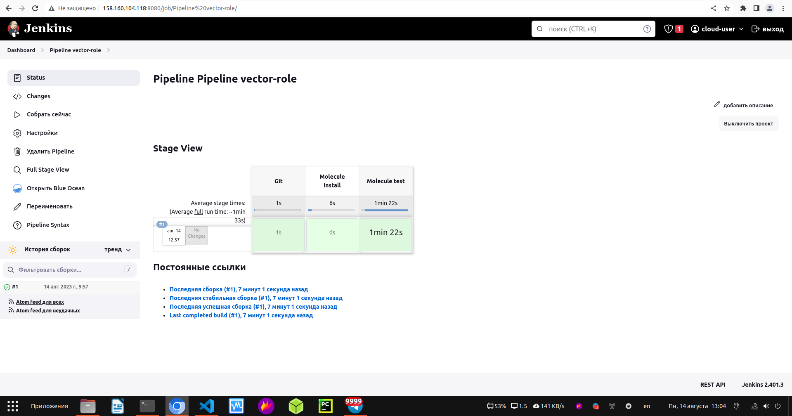

  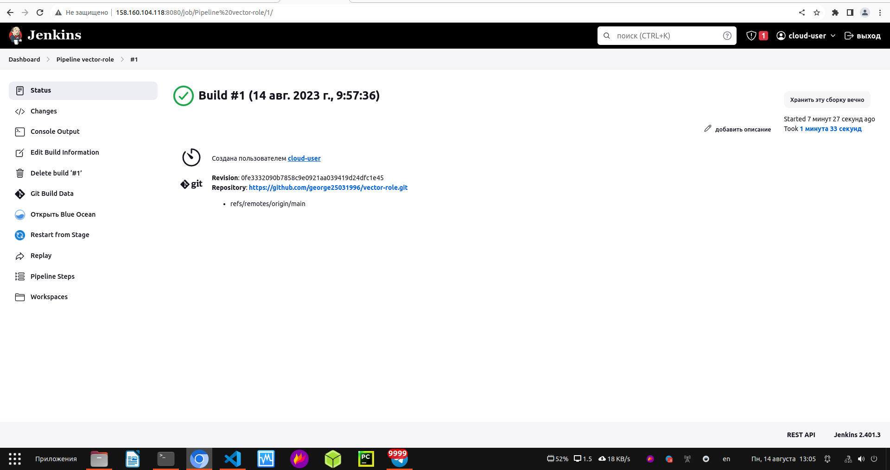

  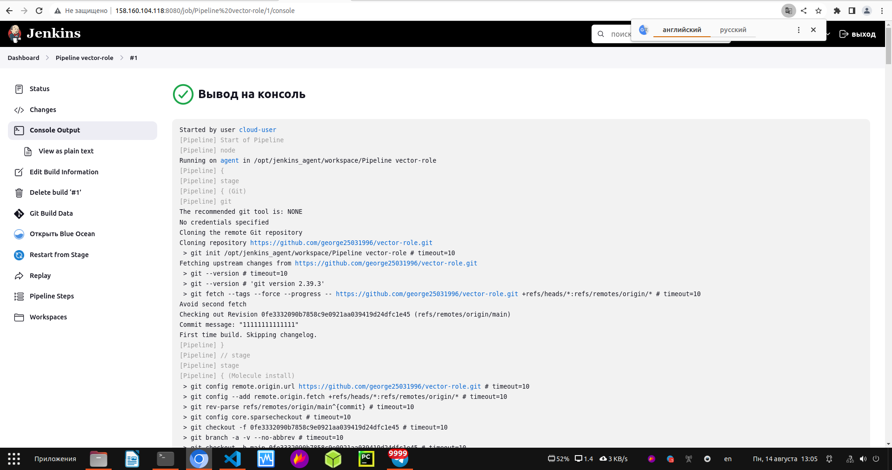

3. Перенести Declarative Pipeline в репозиторий в файл `Jenkinsfile`.

[Jenkinsfile](https://github.com/george25031996/vector-role/blob/main/Jenkinsfile)

4. Создать Multibranch Pipeline на запуск `Jenkinsfile` из репозитория.

Multibranch Pipeline

Branch indexing
10:52:51 Connecting to https://api.github.com with no credentials, anonymous access
10:52:51 Jenkins-Imposed API Limiter: Current quota for Github API usage has 51 remaining (1 over budget). Next quota of 60 in 57 min. Sleeping for 4 min 39 sec.
10:52:51 Jenkins is attempting to evenly distribute GitHub API requests. To configure a different rate limiting strategy, such as having Jenkins restrict GitHub API requests only when near or above the GitHub rate limit, go to "GitHub API usage" under "Configure System" in the Jenkins settings.
10:55:52 Jenkins-Imposed API Limiter: Still sleeping, now only 1 min 36 sec remaining.
Obtained Jenkinsfile from 3a02cb0327f1cf284090d57634372a82cce420c1
[Pipeline] Start of Pipeline
[Pipeline] node
Running on agent in /opt/jenkins_agent/workspace/vector-role2_main
[Pipeline] {
[Pipeline] stage
[Pipeline] { (Declarative: Checkout SCM)
[Pipeline] checkout
The recommended git tool is: NONE
No credentials specified
Cloning the remote Git repository
Cloning with configured refspecs honoured and without tags
Avoid second fetch
Checking out Revision 3a02cb0327f1cf284090d57634372a82cce420c1 (main)
Commit message: "33444666"
First time build. Skipping changelog.
[Pipeline] }
[Pipeline] // stage
Cloning repository https://github.com/george25031996/vector-role.git
 > git init /opt/jenkins_agent/workspace/vector-role2_main # timeout=10
Fetching upstream changes from https://github.com/george25031996/vector-role.git
 > git --version # timeout=10
 > git --version # 'git version 2.39.3'
 > git fetch --no-tags --force --progress -- https://github.com/george25031996/vector-role.git +refs/heads/main:refs/remotes/origin/main # timeout=10
 > git config remote.origin.url https://github.com/george25031996/vector-role.git # timeout=10
 > git config --add remote.origin.fetch +refs/heads/main:refs/remotes/origin/main # timeout=10
 > git config core.sparsecheckout # timeout=10
 > git checkout -f 3a02cb0327f1cf284090d57634372a82cce420c1 # timeout=10
[Pipeline] withEnv
[Pipeline] {
[Pipeline] stage
[Pipeline] { (Git)
[Pipeline] git
The recommended git tool is: NONE
No credentials specified
Fetching changes from the remote Git repository
Checking out Revision 3a02cb0327f1cf284090d57634372a82cce420c1 (refs/remotes/origin/main)
Commit message: "33444666"
[Pipeline] }
[Pipeline] // stage
[Pipeline] stage
[Pipeline] { (Molecule install)
 > git rev-parse --resolve-git-dir /opt/jenkins_agent/workspace/vector-role2_main/.git # timeout=10
 > git config remote.origin.url https://github.com/george25031996/vector-role.git # timeout=10
Fetching upstream changes from https://github.com/george25031996/vector-role.git
 > git --version # timeout=10
 > git --version # 'git version 2.39.3'
 > git fetch --tags --force --progress -- https://github.com/george25031996/vector-role.git +refs/heads/*:refs/remotes/origin/* # timeout=10
 > git rev-parse refs/remotes/origin/main^{commit} # timeout=10
 > git config core.sparsecheckout # timeout=10
 > git checkout -f 3a02cb0327f1cf284090d57634372a82cce420c1 # timeout=10
 > git branch -a -v --no-abbrev # timeout=10
 > git checkout -b main 3a02cb0327f1cf284090d57634372a82cce420c1 # timeout=10
[Pipeline] sh
+ pip install molecule==3.4.0
Defaulting to user installation because normal site-packages is not writeable
Requirement already satisfied: molecule==3.4.0 in /home/jenkins/.local/lib/python3.6/site-packages (3.4.0)
Requirement already satisfied: ansible-lint>=5.1.1 in /home/jenkins/.local/lib/python3.6/site-packages (from molecule==3.4.0) (5.4.0)
Requirement already satisfied: pluggy<1.0,>=0.7.1 in /home/jenkins/.local/lib/python3.6/site-packages (from molecule==3.4.0) (0.13.1)
Requirement already satisfied: cerberus!=1.3.3,!=1.3.4,>=1.3.1 in /usr/local/lib/python3.6/site-packages (from molecule==3.4.0) (1.3.5)
Requirement already satisfied: subprocess-tee>=0.3.2 in /usr/local/lib/python3.6/site-packages (from molecule==3.4.0) (0.3.5)
Requirement already satisfied: Jinja2>=2.11.3 in /usr/local/lib/python3.6/site-packages (from molecule==3.4.0) (3.0.3)
Requirement already satisfied: setuptools>=42 in /usr/local/lib/python3.6/site-packages (from molecule==3.4.0) (59.6.0)
Requirement already satisfied: rich>=9.5.1 in /usr/local/lib/python3.6/site-packages (from molecule==3.4.0) (12.6.0)
Requirement already satisfied: packaging in /usr/local/lib/python3.6/site-packages (from molecule==3.4.0) (21.3)
Requirement already satisfied: PyYAML<6,>=5.1 in /usr/local/lib64/python3.6/site-packages (from molecule==3.4.0) (5.4.1)
Requirement already satisfied: selinux in /usr/local/lib/python3.6/site-packages (from molecule==3.4.0) (0.2.1)
Requirement already satisfied: cookiecutter>=1.7.3 in /usr/local/lib/python3.6/site-packages (from molecule==3.4.0) (1.7.3)
Requirement already satisfied: dataclasses in /usr/local/lib/python3.6/site-packages (from molecule==3.4.0) (0.8)
Requirement already satisfied: paramiko<3,>=2.5.0 in /usr/local/lib/python3.6/site-packages (from molecule==3.4.0) (2.12.0)
Requirement already satisfied: click<9,>=8.0 in /usr/local/lib/python3.6/site-packages (from molecule==3.4.0) (8.0.4)
Requirement already satisfied: click-help-colors>=0.9 in /usr/local/lib/python3.6/site-packages (from molecule==3.4.0) (0.9.1)
Requirement already satisfied: enrich>=1.2.5 in /usr/local/lib/python3.6/site-packages (from molecule==3.4.0) (1.2.7)
Requirement already satisfied: tenacity in /home/jenkins/.local/lib/python3.6/site-packages (from ansible-lint>=5.1.1->molecule==3.4.0) (8.2.2)
Requirement already satisfied: ruamel.yaml<1,>=0.15.34 in /home/jenkins/.local/lib/python3.6/site-packages (from ansible-lint>=5.1.1->molecule==3.4.0) (0.17.32)
Requirement already satisfied: typing-extensions in /usr/local/lib/python3.6/site-packages (from ansible-lint>=5.1.1->molecule==3.4.0) (4.1.1)
Requirement already satisfied: wcmatch>=7.0 in /home/jenkins/.local/lib/python3.6/site-packages (from ansible-lint>=5.1.1->molecule==3.4.0) (8.3)
Requirement already satisfied: importlib-metadata in /usr/local/lib/python3.6/site-packages (from cerberus!=1.3.3,!=1.3.4,>=1.3.1->molecule==3.4.0) (4.8.3)
Requirement already satisfied: binaryornot>=0.4.4 in /usr/local/lib/python3.6/site-packages (from cookiecutter>=1.7.3->molecule==3.4.0) (0.4.4)
Requirement already satisfied: python-slugify>=4.0.0 in /usr/local/lib/python3.6/site-packages (from cookiecutter>=1.7.3->molecule==3.4.0) (6.1.2)
Requirement already satisfied: six>=1.10 in /usr/local/lib/python3.6/site-packages (from cookiecutter>=1.7.3->molecule==3.4.0) (1.16.0)
Requirement already satisfied: requests>=2.23.0 in /usr/local/lib/python3.6/site-packages (from cookiecutter>=1.7.3->molecule==3.4.0) (2.27.1)
Requirement already satisfied: poyo>=0.5.0 in /usr/local/lib/python3.6/site-packages (from cookiecutter>=1.7.3->molecule==3.4.0) (0.5.0)
Requirement already satisfied: jinja2-time>=0.2.0 in /usr/local/lib/python3.6/site-packages (from cookiecutter>=1.7.3->molecule==3.4.0) (0.2.0)
Requirement already satisfied: MarkupSafe>=2.0 in /usr/local/lib64/python3.6/site-packages (from Jinja2>=2.11.3->molecule==3.4.0) (2.0.1)
Requirement already satisfied: bcrypt>=3.1.3 in /usr/local/lib64/python3.6/site-packages (from paramiko<3,>=2.5.0->molecule==3.4.0) (4.0.1)
Requirement already satisfied: pynacl>=1.0.1 in /usr/local/lib64/python3.6/site-packages (from paramiko<3,>=2.5.0->molecule==3.4.0) (1.5.0)
Requirement already satisfied: cryptography>=2.5 in /usr/local/lib64/python3.6/site-packages (from paramiko<3,>=2.5.0->molecule==3.4.0) (40.0.2)
Requirement already satisfied: commonmark<0.10.0,>=0.9.0 in /usr/local/lib/python3.6/site-packages (from rich>=9.5.1->molecule==3.4.0) (0.9.1)
Requirement already satisfied: pygments<3.0.0,>=2.6.0 in /usr/local/lib/python3.6/site-packages (from rich>=9.5.1->molecule==3.4.0) (2.14.0)
Requirement already satisfied: pyparsing!=3.0.5,>=2.0.2 in /usr/local/lib/python3.6/site-packages (from packaging->molecule==3.4.0) (3.1.1)
Requirement already satisfied: distro>=1.3.0 in /usr/local/lib/python3.6/site-packages (from selinux->molecule==3.4.0) (1.8.0)
Requirement already satisfied: chardet>=3.0.2 in /usr/local/lib/python3.6/site-packages (from binaryornot>=0.4.4->cookiecutter>=1.7.3->molecule==3.4.0) (5.0.0)
Requirement already satisfied: cffi>=1.12 in /usr/local/lib64/python3.6/site-packages (from cryptography>=2.5->paramiko<3,>=2.5.0->molecule==3.4.0) (1.15.1)
Requirement already satisfied: zipp>=0.5 in /usr/local/lib/python3.6/site-packages (from importlib-metadata->cerberus!=1.3.3,!=1.3.4,>=1.3.1->molecule==3.4.0) (3.6.0)
Requirement already satisfied: arrow in /usr/local/lib/python3.6/site-packages (from jinja2-time>=0.2.0->cookiecutter>=1.7.3->molecule==3.4.0) (1.2.3)
Requirement already satisfied: text-unidecode>=1.3 in /usr/local/lib/python3.6/site-packages (from python-slugify>=4.0.0->cookiecutter>=1.7.3->molecule==3.4.0) (1.3)
Requirement already satisfied: idna<4,>=2.5 in /usr/local/lib/python3.6/site-packages (from requests>=2.23.0->cookiecutter>=1.7.3->molecule==3.4.0) (3.4)
Requirement already satisfied: certifi>=2017.4.17 in /usr/local/lib/python3.6/site-packages (from requests>=2.23.0->cookiecutter>=1.7.3->molecule==3.4.0) (2023.7.22)
Requirement already satisfied: charset-normalizer~=2.0.0 in /usr/local/lib/python3.6/site-packages (from requests>=2.23.0->cookiecutter>=1.7.3->molecule==3.4.0) (2.0.12)
Requirement already satisfied: urllib3<1.27,>=1.21.1 in /usr/local/lib/python3.6/site-packages (from requests>=2.23.0->cookiecutter>=1.7.3->molecule==3.4.0) (1.26.16)
Requirement already satisfied: ruamel.yaml.clib>=0.2.7 in /home/jenkins/.local/lib/python3.6/site-packages (from ruamel.yaml<1,>=0.15.34->ansible-lint>=5.1.1->molecule==3.4.0) (0.2.7)
Requirement already satisfied: bracex>=2.1.1 in /home/jenkins/.local/lib/python3.6/site-packages (from wcmatch>=7.0->ansible-lint>=5.1.1->molecule==3.4.0) (2.2.1)
Requirement already satisfied: pycparser in /usr/local/lib/python3.6/site-packages (from cffi>=1.12->cryptography>=2.5->paramiko<3,>=2.5.0->molecule==3.4.0) (2.21)
Requirement already satisfied: python-dateutil>=2.7.0 in /usr/local/lib/python3.6/site-packages (from arrow->jinja2-time>=0.2.0->cookiecutter>=1.7.3->molecule==3.4.0) (2.8.2)
[Pipeline] sh
+ pip install 'ansible-lint<6.0.0'
Defaulting to user installation because normal site-packages is not writeable
Requirement already satisfied: ansible-lint<6.0.0 in /home/jenkins/.local/lib/python3.6/site-packages (5.4.0)
Requirement already satisfied: rich>=9.5.1 in /usr/local/lib/python3.6/site-packages (from ansible-lint<6.0.0) (12.6.0)
Requirement already satisfied: ruamel.yaml<1,>=0.15.34 in /home/jenkins/.local/lib/python3.6/site-packages (from ansible-lint<6.0.0) (0.17.32)
Requirement already satisfied: enrich>=1.2.6 in /usr/local/lib/python3.6/site-packages (from ansible-lint<6.0.0) (1.2.7)
Requirement already satisfied: typing-extensions in /usr/local/lib/python3.6/site-packages (from ansible-lint<6.0.0) (4.1.1)
Requirement already satisfied: wcmatch>=7.0 in /home/jenkins/.local/lib/python3.6/site-packages (from ansible-lint<6.0.0) (8.3)
Requirement already satisfied: packaging in /usr/local/lib/python3.6/site-packages (from ansible-lint<6.0.0) (21.3)
Requirement already satisfied: tenacity in /home/jenkins/.local/lib/python3.6/site-packages (from ansible-lint<6.0.0) (8.2.2)
Requirement already satisfied: pyyaml in /usr/local/lib64/python3.6/site-packages (from ansible-lint<6.0.0) (5.4.1)
Requirement already satisfied: dataclasses<0.9,>=0.7 in /usr/local/lib/python3.6/site-packages (from rich>=9.5.1->ansible-lint<6.0.0) (0.8)
Requirement already satisfied: pygments<3.0.0,>=2.6.0 in /usr/local/lib/python3.6/site-packages (from rich>=9.5.1->ansible-lint<6.0.0) (2.14.0)
Requirement already satisfied: commonmark<0.10.0,>=0.9.0 in /usr/local/lib/python3.6/site-packages (from rich>=9.5.1->ansible-lint<6.0.0) (0.9.1)
Requirement already satisfied: ruamel.yaml.clib>=0.2.7 in /home/jenkins/.local/lib/python3.6/site-packages (from ruamel.yaml<1,>=0.15.34->ansible-lint<6.0.0) (0.2.7)
Requirement already satisfied: bracex>=2.1.1 in /home/jenkins/.local/lib/python3.6/site-packages (from wcmatch>=7.0->ansible-lint<6.0.0) (2.2.1)
Requirement already satisfied: pyparsing!=3.0.5,>=2.0.2 in /usr/local/lib/python3.6/site-packages (from packaging->ansible-lint<6.0.0) (3.1.1)
[Pipeline] sh
+ pip install molecule_docker
Defaulting to user installation because normal site-packages is not writeable
Requirement already satisfied: molecule_docker in /usr/local/lib/python3.6/site-packages (1.1.0)
Requirement already satisfied: molecule>=3.4.0 in /home/jenkins/.local/lib/python3.6/site-packages (from molecule_docker) (3.4.0)
Requirement already satisfied: docker>=4.3.1 in /usr/local/lib/python3.6/site-packages (from molecule_docker) (5.0.3)
Requirement already satisfied: requests in /usr/local/lib/python3.6/site-packages (from molecule_docker) (2.27.1)
Requirement already satisfied: ansible-compat>=0.5.0 in /usr/local/lib/python3.6/site-packages (from molecule_docker) (1.0.0)
Requirement already satisfied: selinux in /usr/local/lib/python3.6/site-packages (from molecule_docker) (0.2.1)
Requirement already satisfied: PyYAML in /usr/local/lib64/python3.6/site-packages (from ansible-compat>=0.5.0->molecule_docker) (5.4.1)
Requirement already satisfied: cached-property~=1.5 in /usr/local/lib/python3.6/site-packages (from ansible-compat>=0.5.0->molecule_docker) (1.5.2)
Requirement already satisfied: subprocess-tee>=0.3.5 in /usr/local/lib/python3.6/site-packages (from ansible-compat>=0.5.0->molecule_docker) (0.3.5)
Requirement already satisfied: websocket-client>=0.32.0 in /usr/local/lib/python3.6/site-packages (from docker>=4.3.1->molecule_docker) (1.3.1)
Requirement already satisfied: cerberus!=1.3.3,!=1.3.4,>=1.3.1 in /usr/local/lib/python3.6/site-packages (from molecule>=3.4.0->molecule_docker) (1.3.5)
Requirement already satisfied: Jinja2>=2.11.3 in /usr/local/lib/python3.6/site-packages (from molecule>=3.4.0->molecule_docker) (3.0.3)
Requirement already satisfied: enrich>=1.2.5 in /usr/local/lib/python3.6/site-packages (from molecule>=3.4.0->molecule_docker) (1.2.7)
Requirement already satisfied: rich>=9.5.1 in /usr/local/lib/python3.6/site-packages (from molecule>=3.4.0->molecule_docker) (12.6.0)
Requirement already satisfied: dataclasses in /usr/local/lib/python3.6/site-packages (from molecule>=3.4.0->molecule_docker) (0.8)
Requirement already satisfied: packaging in /usr/local/lib/python3.6/site-packages (from molecule>=3.4.0->molecule_docker) (21.3)
Requirement already satisfied: click-help-colors>=0.9 in /usr/local/lib/python3.6/site-packages (from molecule>=3.4.0->molecule_docker) (0.9.1)
Requirement already satisfied: cookiecutter>=1.7.3 in /usr/local/lib/python3.6/site-packages (from molecule>=3.4.0->molecule_docker) (1.7.3)
Requirement already satisfied: ansible-lint>=5.1.1 in /home/jenkins/.local/lib/python3.6/site-packages (from molecule>=3.4.0->molecule_docker) (5.4.0)
Requirement already satisfied: click<9,>=8.0 in /usr/local/lib/python3.6/site-packages (from molecule>=3.4.0->molecule_docker) (8.0.4)
Requirement already satisfied: paramiko<3,>=2.5.0 in /usr/local/lib/python3.6/site-packages (from molecule>=3.4.0->molecule_docker) (2.12.0)
Requirement already satisfied: pluggy<1.0,>=0.7.1 in /home/jenkins/.local/lib/python3.6/site-packages (from molecule>=3.4.0->molecule_docker) (0.13.1)
Requirement already satisfied: setuptools>=42 in /usr/local/lib/python3.6/site-packages (from molecule>=3.4.0->molecule_docker) (59.6.0)
Requirement already satisfied: certifi>=2017.4.17 in /usr/local/lib/python3.6/site-packages (from requests->molecule_docker) (2023.7.22)
Requirement already satisfied: urllib3<1.27,>=1.21.1 in /usr/local/lib/python3.6/site-packages (from requests->molecule_docker) (1.26.16)
Requirement already satisfied: charset-normalizer~=2.0.0 in /usr/local/lib/python3.6/site-packages (from requests->molecule_docker) (2.0.12)
Requirement already satisfied: idna<4,>=2.5 in /usr/local/lib/python3.6/site-packages (from requests->molecule_docker) (3.4)
Requirement already satisfied: distro>=1.3.0 in /usr/local/lib/python3.6/site-packages (from selinux->molecule_docker) (1.8.0)
Requirement already satisfied: tenacity in /home/jenkins/.local/lib/python3.6/site-packages (from ansible-lint>=5.1.1->molecule>=3.4.0->molecule_docker) (8.2.2)
Requirement already satisfied: wcmatch>=7.0 in /home/jenkins/.local/lib/python3.6/site-packages (from ansible-lint>=5.1.1->molecule>=3.4.0->molecule_docker) (8.3)
Requirement already satisfied: typing-extensions in /usr/local/lib/python3.6/site-packages (from ansible-lint>=5.1.1->molecule>=3.4.0->molecule_docker) (4.1.1)
Requirement already satisfied: ruamel.yaml<1,>=0.15.34 in /home/jenkins/.local/lib/python3.6/site-packages (from ansible-lint>=5.1.1->molecule>=3.4.0->molecule_docker) (0.17.32)
Requirement already satisfied: importlib-metadata in /usr/local/lib/python3.6/site-packages (from cerberus!=1.3.3,!=1.3.4,>=1.3.1->molecule>=3.4.0->molecule_docker) (4.8.3)
Requirement already satisfied: python-slugify>=4.0.0 in /usr/local/lib/python3.6/site-packages (from cookiecutter>=1.7.3->molecule>=3.4.0->molecule_docker) (6.1.2)
Requirement already satisfied: binaryornot>=0.4.4 in /usr/local/lib/python3.6/site-packages (from cookiecutter>=1.7.3->molecule>=3.4.0->molecule_docker) (0.4.4)
Requirement already satisfied: poyo>=0.5.0 in /usr/local/lib/python3.6/site-packages (from cookiecutter>=1.7.3->molecule>=3.4.0->molecule_docker) (0.5.0)
Requirement already satisfied: six>=1.10 in /usr/local/lib/python3.6/site-packages (from cookiecutter>=1.7.3->molecule>=3.4.0->molecule_docker) (1.16.0)
Requirement already satisfied: jinja2-time>=0.2.0 in /usr/local/lib/python3.6/site-packages (from cookiecutter>=1.7.3->molecule>=3.4.0->molecule_docker) (0.2.0)
Requirement already satisfied: MarkupSafe>=2.0 in /usr/local/lib64/python3.6/site-packages (from Jinja2>=2.11.3->molecule>=3.4.0->molecule_docker) (2.0.1)
Requirement already satisfied: cryptography>=2.5 in /usr/local/lib64/python3.6/site-packages (from paramiko<3,>=2.5.0->molecule>=3.4.0->molecule_docker) (40.0.2)
Requirement already satisfied: bcrypt>=3.1.3 in /usr/local/lib64/python3.6/site-packages (from paramiko<3,>=2.5.0->molecule>=3.4.0->molecule_docker) (4.0.1)
Requirement already satisfied: pynacl>=1.0.1 in /usr/local/lib64/python3.6/site-packages (from paramiko<3,>=2.5.0->molecule>=3.4.0->molecule_docker) (1.5.0)
Requirement already satisfied: pygments<3.0.0,>=2.6.0 in /usr/local/lib/python3.6/site-packages (from rich>=9.5.1->molecule>=3.4.0->molecule_docker) (2.14.0)
Requirement already satisfied: commonmark<0.10.0,>=0.9.0 in /usr/local/lib/python3.6/site-packages (from rich>=9.5.1->molecule>=3.4.0->molecule_docker) (0.9.1)
Requirement already satisfied: pyparsing!=3.0.5,>=2.0.2 in /usr/local/lib/python3.6/site-packages (from packaging->molecule>=3.4.0->molecule_docker) (3.1.1)
Requirement already satisfied: chardet>=3.0.2 in /usr/local/lib/python3.6/site-packages (from binaryornot>=0.4.4->cookiecutter>=1.7.3->molecule>=3.4.0->molecule_docker) (5.0.0)
Requirement already satisfied: cffi>=1.12 in /usr/local/lib64/python3.6/site-packages (from cryptography>=2.5->paramiko<3,>=2.5.0->molecule>=3.4.0->molecule_docker) (1.15.1)
Requirement already satisfied: zipp>=0.5 in /usr/local/lib/python3.6/site-packages (from importlib-metadata->cerberus!=1.3.3,!=1.3.4,>=1.3.1->molecule>=3.4.0->molecule_docker) (3.6.0)
Requirement already satisfied: arrow in /usr/local/lib/python3.6/site-packages (from jinja2-time>=0.2.0->cookiecutter>=1.7.3->molecule>=3.4.0->molecule_docker) (1.2.3)
Requirement already satisfied: text-unidecode>=1.3 in /usr/local/lib/python3.6/site-packages (from python-slugify>=4.0.0->cookiecutter>=1.7.3->molecule>=3.4.0->molecule_docker) (1.3)
Requirement already satisfied: ruamel.yaml.clib>=0.2.7 in /home/jenkins/.local/lib/python3.6/site-packages (from ruamel.yaml<1,>=0.15.34->ansible-lint>=5.1.1->molecule>=3.4.0->molecule_docker) (0.2.7)
Requirement already satisfied: bracex>=2.1.1 in /home/jenkins/.local/lib/python3.6/site-packages (from wcmatch>=7.0->ansible-lint>=5.1.1->molecule>=3.4.0->molecule_docker) (2.2.1)
Requirement already satisfied: pycparser in /usr/local/lib/python3.6/site-packages (from cffi>=1.12->cryptography>=2.5->paramiko<3,>=2.5.0->molecule>=3.4.0->molecule_docker) (2.21)
Requirement already satisfied: python-dateutil>=2.7.0 in /usr/local/lib/python3.6/site-packages (from arrow->jinja2-time>=0.2.0->cookiecutter>=1.7.3->molecule>=3.4.0->molecule_docker) (2.8.2)
[Pipeline] }
[Pipeline] // stage
[Pipeline] stage
[Pipeline] { (Molecule test)
[Pipeline] sh
+ molecule test -s centos7
/usr/local/lib/python3.6/site-packages/requests/__init__.py:104: RequestsDependencyWarning: urllib3 (1.26.16) or chardet (5.0.0)/charset_normalizer (2.0.12) doesn't match a supported version!
  RequestsDependencyWarning)
INFO     centos7 scenario test matrix: dependency, lint, cleanup, destroy, syntax, create, prepare, converge, idempotence, side_effect, verify, cleanup, destroy
INFO     Performing prerun...
INFO     Guessed /opt/jenkins_agent/workspace/vector-role2_main as project root directory
INFO     Running ansible-galaxy role install --force --roles-path /home/jenkins/.cache/ansible-lint/d91a8a/roles -vr molecule/centos7/requirements.yml
WARNING  Computed fully qualified role name of vector-role2_main does not follow current galaxy requirements.
Please edit meta/main.yml and assure we can correctly determine full role name:

galaxy_info:
role_name: my_name  # if absent directory name hosting role is used instead
namespace: my_galaxy_namespace  # if absent, author is used instead

Namespace: https://galaxy.ansible.com/docs/contributing/namespaces.html#galaxy-namespace-limitations
Role: https://galaxy.ansible.com/docs/contributing/creating_role.html#role-names

As an alternative, you can add 'role-name' to either skip_list or warn_list.

INFO     Using /home/jenkins/.cache/ansible-lint/d91a8a/roles/vector-role2_main symlink to current repository in order to enable Ansible to find the role using its expected full name.
INFO     Added ANSIBLE_ROLES_PATH=~/.ansible/roles:/usr/share/ansible/roles:/etc/ansible/roles:/home/jenkins/.cache/ansible-lint/d91a8a/roles
INFO     Running centos7 > dependency
[DEPRECATION WARNING]: Ansible will require Python 3.8 or newer on the 
controller starting with Ansible 2.12. Current version: 3.6.8 (default, Jun 26 
2023, 20:26:30) [GCC 8.5.0 20210514 (Red Hat 8.5.0-20)]. This feature will be 
removed from ansible-core in version 2.12. Deprecation warnings can be disabled
 by setting deprecation_warnings=False in ansible.cfg.
/usr/local/lib/python3.6/site-packages/ansible/parsing/vault/__init__.py:44: CryptographyDeprecationWarning: Python 3.6 is no longer supported by the Python core team. Therefore, support for it is deprecated in cryptography. The next release of cryptography will remove support for Python 3.6.
  from cryptography.exceptions import InvalidSignature
WARNING  Skipping, missing the requirements file.
[DEPRECATION WARNING]: Ansible will require Python 3.8 or newer on the 
controller starting with Ansible 2.12. Current version: 3.6.8 (default, Jun 26 
2023, 20:26:30) [GCC 8.5.0 20210514 (Red Hat 8.5.0-20)]. This feature will be 
removed from ansible-core in version 2.12. Deprecation warnings can be disabled
 by setting deprecation_warnings=False in ansible.cfg.
/usr/local/lib/python3.6/site-packages/ansible/parsing/vault/__init__.py:44: CryptographyDeprecationWarning: Python 3.6 is no longer supported by the Python core team. Therefore, support for it is deprecated in cryptography. The next release of cryptography will remove support for Python 3.6.
  from cryptography.exceptions import InvalidSignature
WARNING  Skipping, missing the requirements file.
INFO     Running centos7 > lint
INFO     Lint is disabled.
INFO     Running centos7 > cleanup
WARNING  Skipping, cleanup playbook not configured.
INFO     Running centos7 > destroy
INFO     Sanity checks: 'docker'
/usr/local/lib/python3.6/site-packages/paramiko/transport.py:33: CryptographyDeprecationWarning: Python 3.6 is no longer supported by the Python core team. Therefore, support for it is deprecated in cryptography. The next release of cryptography will remove support for Python 3.6.
  from cryptography.hazmat.backends import default_backend
[DEPRECATION WARNING]: Ansible will require Python 3.8 or newer on the
controller starting with Ansible 2.12. Current version: 3.6.8 (default, Jun 26
2023, 20:26:30) [GCC 8.5.0 20210514 (Red Hat 8.5.0-20)]. This feature will be
removed from ansible-core in version 2.12. Deprecation warnings can be disabled
 by setting deprecation_warnings=False in ansible.cfg.

PLAY [Destroy] *****************************************************************

TASK [Destroy molecule instance(s)] ********************************************
/usr/local/lib/python3.6/site-packages/ansible/parsing/vault/__init__.py:44: CryptographyDeprecationWarning: Python 3.6 is no longer supported by the Python core team. Therefore, support for it is deprecated in cryptography. The next release of cryptography will remove support for Python 3.6.
  from cryptography.exceptions import InvalidSignature
changed: [localhost] => (item=instance)

TASK [Wait for instance(s) deletion to complete] *******************************
FAILED - RETRYING: Wait for instance(s) deletion to complete (300 retries left).
ok: [localhost] => (item=instance)

TASK [Delete docker networks(s)] ***********************************************

PLAY RECAP *********************************************************************
localhost                  : ok=2    changed=1    unreachable=0    failed=0    skipped=1    rescued=0    ignored=0

INFO     Running centos7 > syntax
[DEPRECATION WARNING]: Ansible will require Python 3.8 or newer on the
controller starting with Ansible 2.12. Current version: 3.6.8 (default, Jun 26
2023, 20:26:30) [GCC 8.5.0 20210514 (Red Hat 8.5.0-20)]. This feature will be
removed from ansible-core in version 2.12. Deprecation warnings can be disabled
 by setting deprecation_warnings=False in ansible.cfg.

playbook: /opt/jenkins_agent/workspace/vector-role2_main/molecule/centos7/converge.yml
/usr/local/lib/python3.6/site-packages/ansible/parsing/vault/__init__.py:44: CryptographyDeprecationWarning: Python 3.6 is no longer supported by the Python core team. Therefore, support for it is deprecated in cryptography. The next release of cryptography will remove support for Python 3.6.
  from cryptography.exceptions import InvalidSignature
INFO     Running centos7 > create
[DEPRECATION WARNING]: Ansible will require Python 3.8 or newer on the
controller starting with Ansible 2.12. Current version: 3.6.8 (default, Jun 26
2023, 20:26:30) [GCC 8.5.0 20210514 (Red Hat 8.5.0-20)]. This feature will be
removed from ansible-core in version 2.12. Deprecation warnings can be disabled
 by setting deprecation_warnings=False in ansible.cfg.

PLAY [Create] ******************************************************************

TASK [Log into a Docker registry] **********************************************
/usr/local/lib/python3.6/site-packages/ansible/parsing/vault/__init__.py:44: CryptographyDeprecationWarning: Python 3.6 is no longer supported by the Python core team. Therefore, support for it is deprecated in cryptography. The next release of cryptography will remove support for Python 3.6.
  from cryptography.exceptions import InvalidSignature
skipping: [localhost] => (item=None)
skipping: [localhost]

TASK [Check presence of custom Dockerfiles] ************************************
ok: [localhost] => (item={'image': 'docker.io/pycontribs/centos:7', 'name': 'instance', 'pre_build_image': True})

TASK [Create Dockerfiles from image names] *************************************
skipping: [localhost] => (item={'image': 'docker.io/pycontribs/centos:7', 'name': 'instance', 'pre_build_image': True})

TASK [Discover local Docker images] ********************************************
ok: [localhost] => (item={'changed': False, 'skipped': True, 'skip_reason': 'Conditional result was False', 'item': {'image': 'docker.io/pycontribs/centos:7', 'name': 'instance', 'pre_build_image': True}, 'ansible_loop_var': 'item', 'i': 0, 'ansible_index_var': 'i'})

TASK [Build an Ansible compatible image (new)] *********************************
skipping: [localhost] => (item=molecule_local/docker.io/pycontribs/centos:7)

TASK [Create docker network(s)] ************************************************

TASK [Determine the CMD directives] ********************************************
ok: [localhost] => (item={'image': 'docker.io/pycontribs/centos:7', 'name': 'instance', 'pre_build_image': True})

TASK [Create molecule instance(s)] *********************************************
changed: [localhost] => (item=instance)

TASK [Wait for instance(s) creation to complete] *******************************
FAILED - RETRYING: Wait for instance(s) creation to complete (300 retries left).
changed: [localhost] => (item={'started': 1, 'finished': 0, 'ansible_job_id': '963840195332.37113', 'results_file': '/home/jenkins/.ansible_async/963840195332.37113', 'changed': True, 'failed': False, 'item': {'image': 'docker.io/pycontribs/centos:7', 'name': 'instance', 'pre_build_image': True}, 'ansible_loop_var': 'item'})

PLAY RECAP *********************************************************************
localhost                  : ok=5    changed=2    unreachable=0    failed=0    skipped=4    rescued=0    ignored=0

INFO     Running centos7 > prepare
WARNING  Skipping, prepare playbook not configured.
INFO     Running centos7 > converge
[DEPRECATION WARNING]: Ansible will require Python 3.8 or newer on the
controller starting with Ansible 2.12. Current version: 3.6.8 (default, Jun 26
2023, 20:26:30) [GCC 8.5.0 20210514 (Red Hat 8.5.0-20)]. This feature will be
removed from ansible-core in version 2.12. Deprecation warnings can be disabled
 by setting deprecation_warnings=False in ansible.cfg.

PLAY [Converge] ****************************************************************

TASK [Gathering Facts] *********************************************************
/usr/local/lib/python3.6/site-packages/ansible/parsing/vault/__init__.py:44: CryptographyDeprecationWarning: Python 3.6 is no longer supported by the Python core team. Therefore, support for it is deprecated in cryptography. The next release of cryptography will remove support for Python 3.6.
  from cryptography.exceptions import InvalidSignature
ok: [instance]

TASK [Include vector-role] *****************************************************

TASK [vector-role : Install vector] ********************************************
included: /opt/jenkins_agent/workspace/vector-role/tasks/install_vector_docker.yml for instance

TASK [vector-role : VECTOR | Install rpm] **************************************
changed: [instance]

TASK [vector-role : VECTOR | Template config] **********************************
changed: [instance]

TASK [vector-role : Put docker package on hold] ********************************
ok: [instance]

TASK [vector-role : Install vector] ********************************************
skipping: [instance]

PLAY RECAP *********************************************************************
instance                   : ok=5    changed=2    unreachable=0    failed=0    skipped=1    rescued=0    ignored=0

INFO     Running centos7 > idempotence
[DEPRECATION WARNING]: Ansible will require Python 3.8 or newer on the
controller starting with Ansible 2.12. Current version: 3.6.8 (default, Jun 26
2023, 20:26:30) [GCC 8.5.0 20210514 (Red Hat 8.5.0-20)]. This feature will be
removed from ansible-core in version 2.12. Deprecation warnings can be disabled
 by setting deprecation_warnings=False in ansible.cfg.

PLAY [Converge] ****************************************************************

TASK [Gathering Facts] *********************************************************
/usr/local/lib/python3.6/site-packages/ansible/parsing/vault/__init__.py:44: CryptographyDeprecationWarning: Python 3.6 is no longer supported by the Python core team. Therefore, support for it is deprecated in cryptography. The next release of cryptography will remove support for Python 3.6.
  from cryptography.exceptions import InvalidSignature
ok: [instance]

TASK [Include vector-role] *****************************************************

TASK [vector-role : Install vector] ********************************************
included: /opt/jenkins_agent/workspace/vector-role/tasks/install_vector_docker.yml for instance

TASK [vector-role : VECTOR | Install rpm] **************************************
ok: [instance]

TASK [vector-role : VECTOR | Template config] **********************************
ok: [instance]

TASK [vector-role : Put docker package on hold] ********************************
ok: [instance]

TASK [vector-role : Install vector] ********************************************
skipping: [instance]

PLAY RECAP *********************************************************************
instance                   : ok=5    changed=0    unreachable=0    failed=0    skipped=1    rescued=0    ignored=0

INFO     Idempotence completed successfully.
INFO     Running centos7 > side_effect
WARNING  Skipping, side effect playbook not configured.
INFO     Running centos7 > verify
INFO     Running Ansible Verifier
[DEPRECATION WARNING]: Ansible will require Python 3.8 or newer on the
controller starting with Ansible 2.12. Current version: 3.6.8 (default, Jun 26
2023, 20:26:30) [GCC 8.5.0 20210514 (Red Hat 8.5.0-20)]. This feature will be
removed from ansible-core in version 2.12. Deprecation warnings can be disabled
 by setting deprecation_warnings=False in ansible.cfg.

PLAY [Verify] ******************************************************************

TASK [Example assertion] *******************************************************
/usr/local/lib/python3.6/site-packages/ansible/parsing/vault/__init__.py:44: CryptographyDeprecationWarning: Python 3.6 is no longer supported by the Python core team. Therefore, support for it is deprecated in cryptography. The next release of cryptography will remove support for Python 3.6.
  from cryptography.exceptions import InvalidSignature
ok: [instance] => {
    "changed": false,
    "msg": "All assertions passed"
}

TASK [Check Vector configs] ****************************************************
changed: [instance]

TASK [Check Vector status] *****************************************************
changed: [instance]

PLAY RECAP *********************************************************************
instance                   : ok=3    changed=2    unreachable=0    failed=0    skipped=0    rescued=0    ignored=0

INFO     Verifier completed successfully.
INFO     Running centos7 > cleanup
WARNING  Skipping, cleanup playbook not configured.
INFO     Running centos7 > destroy
[DEPRECATION WARNING]: Ansible will require Python 3.8 or newer on the
controller starting with Ansible 2.12. Current version: 3.6.8 (default, Jun 26
2023, 20:26:30) [GCC 8.5.0 20210514 (Red Hat 8.5.0-20)]. This feature will be
removed from ansible-core in version 2.12. Deprecation warnings can be disabled
 by setting deprecation_warnings=False in ansible.cfg.

PLAY [Destroy] *****************************************************************

TASK [Destroy molecule instance(s)] ********************************************
/usr/local/lib/python3.6/site-packages/ansible/parsing/vault/__init__.py:44: CryptographyDeprecationWarning: Python 3.6 is no longer supported by the Python core team. Therefore, support for it is deprecated in cryptography. The next release of cryptography will remove support for Python 3.6.
  from cryptography.exceptions import InvalidSignature
changed: [localhost] => (item=instance)

TASK [Wait for instance(s) deletion to complete] *******************************
FAILED - RETRYING: Wait for instance(s) deletion to complete (300 retries left).
changed: [localhost] => (item=instance)

TASK [Delete docker networks(s)] ***********************************************

PLAY RECAP *********************************************************************
localhost                  : ok=2    changed=2    unreachable=0    failed=0    skipped=1    rescued=0    ignored=0

INFO     Pruning extra files from scenario ephemeral directory
[Pipeline] cleanWs
[WS-CLEANUP] Deleting project workspace...
[WS-CLEANUP] Deferred wipeout is used...
[WS-CLEANUP] done
[Pipeline] }
[Pipeline] // stage
[Pipeline] }
[Pipeline] // withEnv
[Pipeline] }
[Pipeline] // node
[Pipeline] End of Pipeline
Finished: SUCCESS

  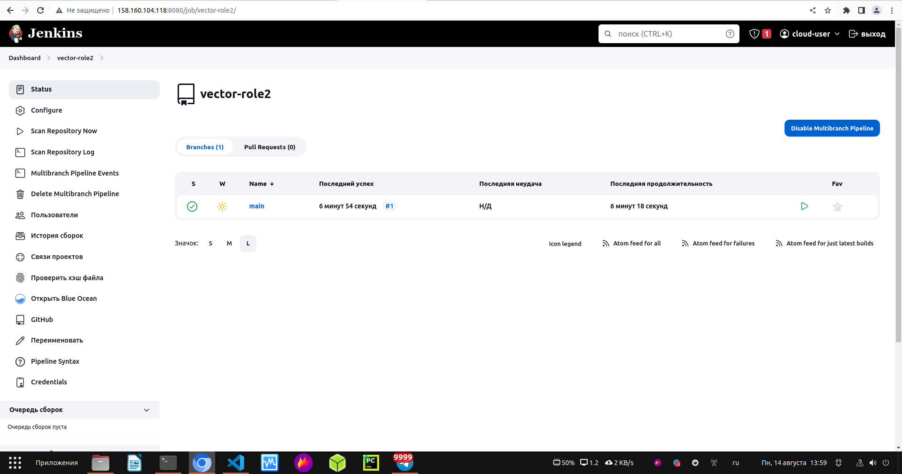

  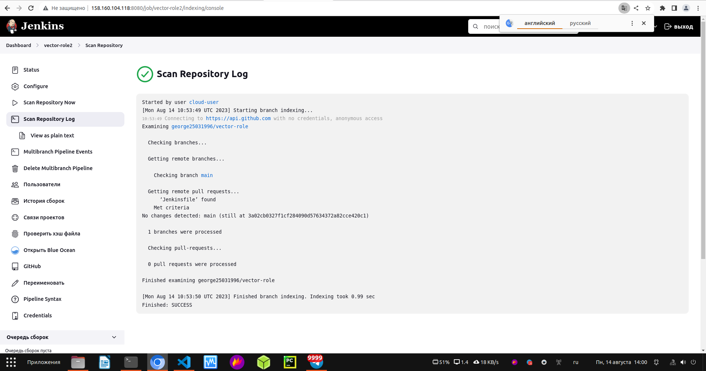

  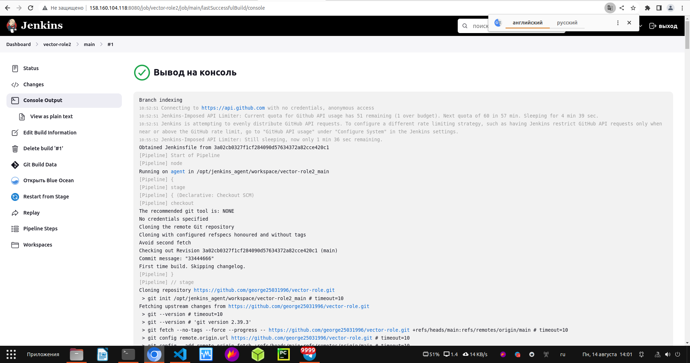

5. Создать Scripted Pipeline, наполнить его скриптом из [pipeline](./pipeline).

  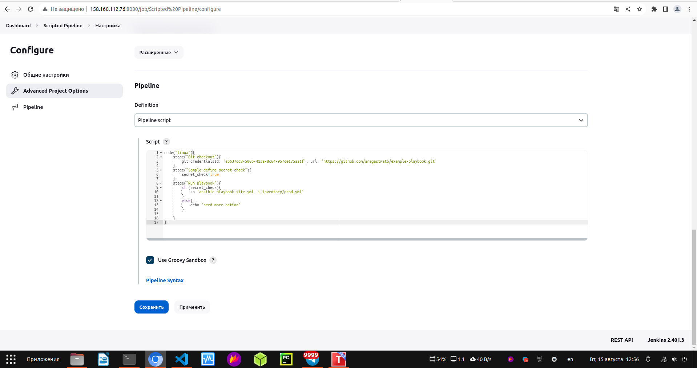

6. Внести необходимые изменения, чтобы Pipeline запускал `ansible-playbook` без флагов `--check --diff`, если не установлен параметр при запуске джобы (prod_run = True). По умолчанию параметр имеет значение False и запускает прогон с флагами `--check --diff`.

  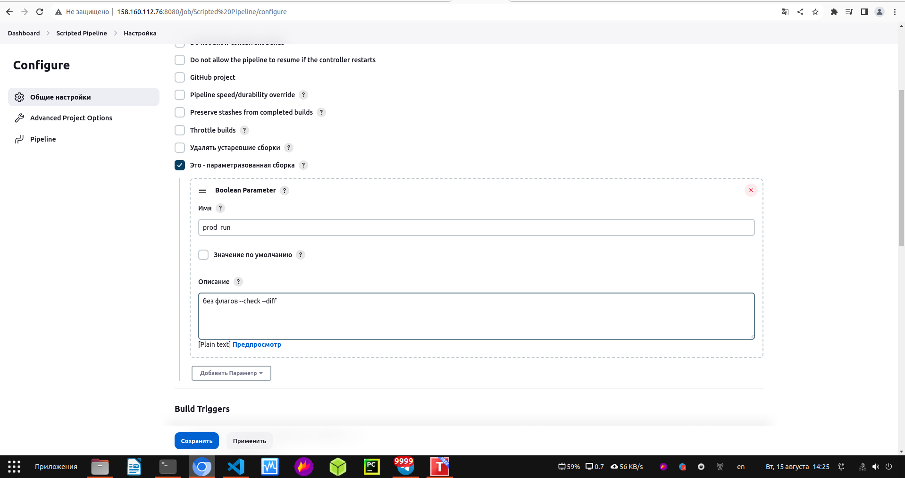

7. Проверить работоспособность, исправить ошибки, исправленный Pipeline вложить в репозиторий в файл `ScriptedJenkinsfile`.

  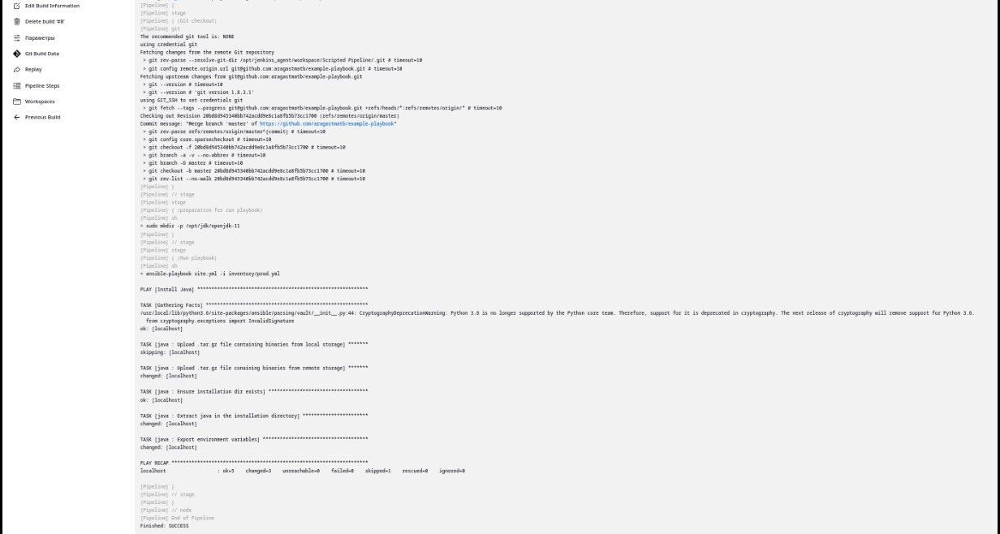

8. Отправить ссылку на репозиторий с ролью и Declarative Pipeline и Scripted Pipeline.

[vector-role](https://github.com/george25031996/vector-role)

[Declarative Pipeline](https://github.com/george25031996/CI-CD/blob/main/09-ci-04-jenkins/infrastructure/files/DeclarativePipeline)

[Scripted Pipeline](https://github.com/george25031996/CI-CD/blob/main/09-ci-04-jenkins/infrastructure/files/ScriptedJenkinsfile)
