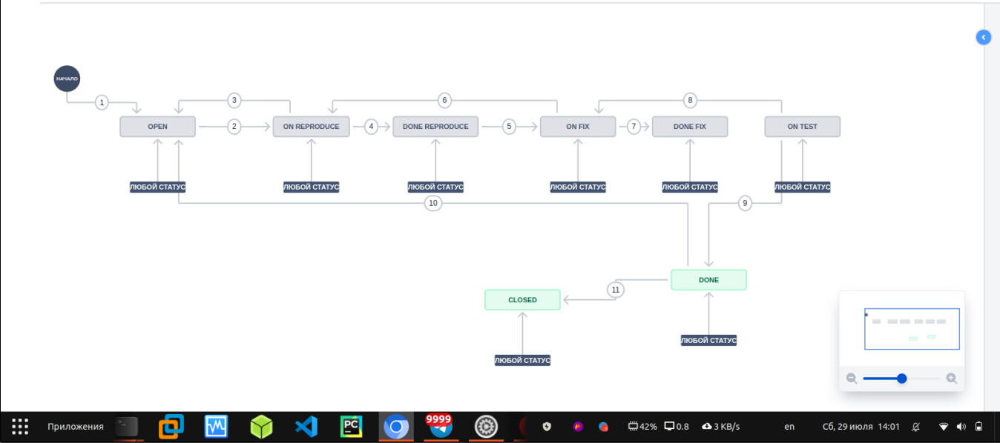
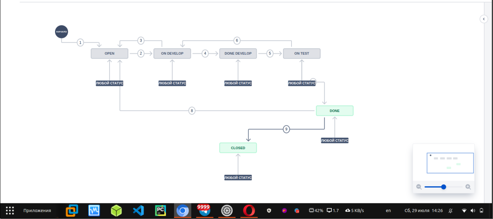
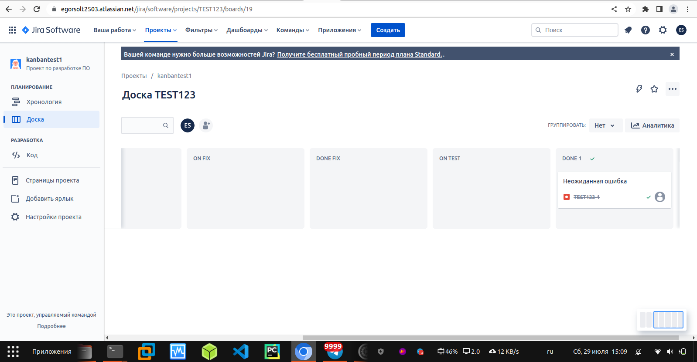
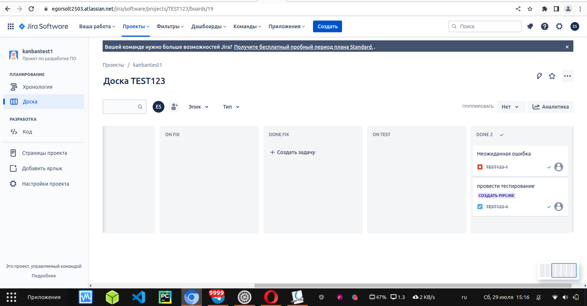
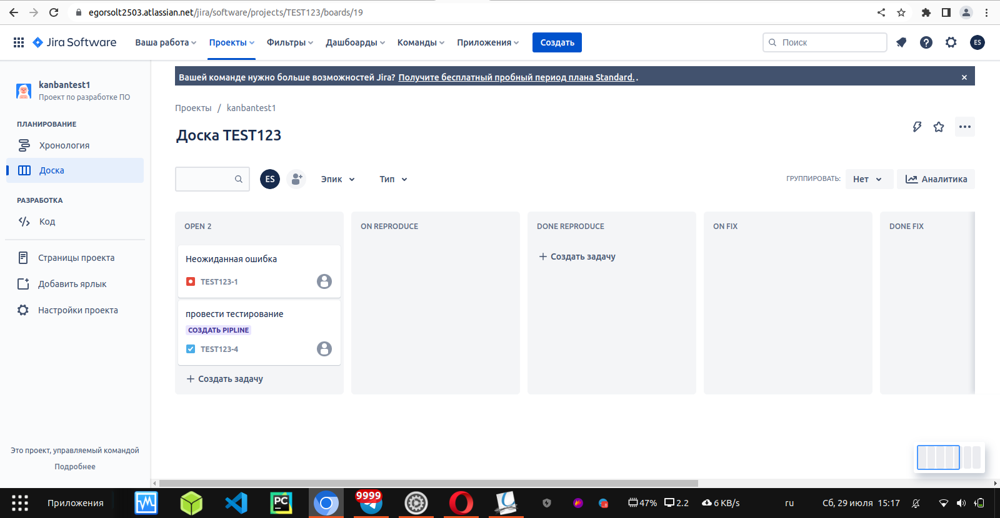
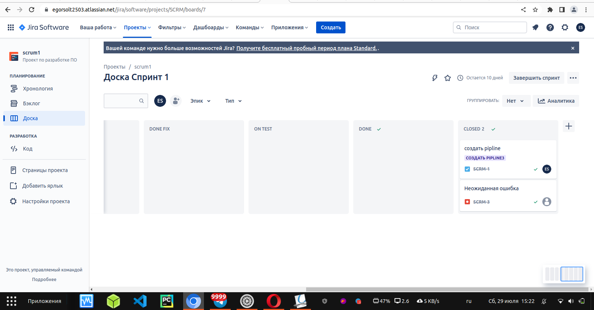
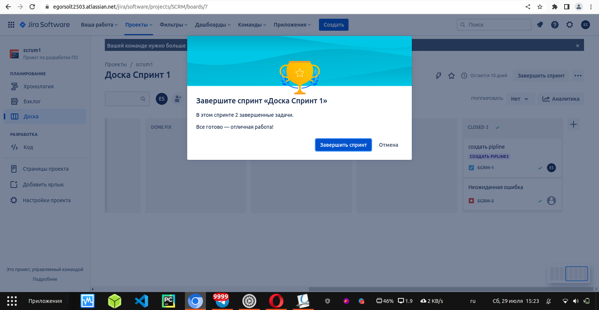

Домашнее задание к занятию 7 «Жизненный цикл ПО»

Необходимо создать собственные workflow для двух типов задач: bug и остальные типы задач. Задачи типа bug должны проходить жизненный цикл:

Open -> On reproduce.
On reproduce -> Open, Done reproduce.
Done reproduce -> On fix.
On fix -> On reproduce, Done fix.
Done fix -> On test.
On test -> On fix, Done.
Done -> Closed, Open.

Создал Workflow для задачи типа bug:

  

Остальные задачи должны проходить по упрощённому workflow:

Open -> On develop.
On develop -> Open, Done develop.
Done develop -> On test.
On test -> On develop, Done.
Done -> Closed, Open.

Создал Workflow для остальных задач по упрощённому workflow: 

  

Что нужно сделать

Создайте задачу с типом bug, попытайтесь провести его по всему workflow до Done.

Создал задачу с типом bug и провести её по всему workflow до Done:

  

Создайте задачу с типом epic, к ней привяжите несколько задач с типом task, проведите их по всему workflow до Done.

Создал задачу с типом epic, к ней привязал несколько задач с типом task, провел их по всему workflow до Done:

  

При проведении обеих задач по статусам используйте kanban.

Использовал Kanban

Верните задачи в статус Open.

Вернул задачи в статус Open.

  

Перейдите в Scrum, запланируйте новый спринт, состоящий из задач эпика и одного бага, стартуйте спринт, проведите задачи до состояния Closed. Закройте спринт.

  

  

Если всё отработалось в рамках ожидания — выгрузите схемы workflow для импорта в XML. Файлы с workflow и скриншоты workflow приложите к решению задания.
