# Домашнее задание к занятию 9 «Процессы CI/CD»

## Подготовка к выполнению

1. Создайте два VM в Yandex Cloud с параметрами: 2CPU 4RAM Centos7 (остальное по минимальным требованиям).

Создал два VM в Yandex Cloud с параметрами: 2CPU 4RAM Centos7:

  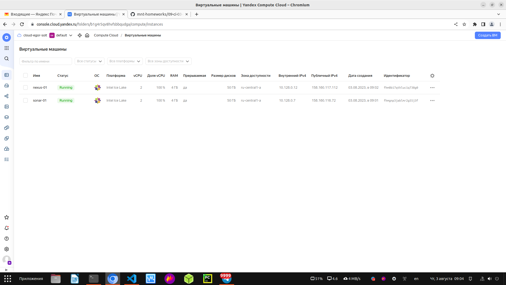

2. Пропишите в [inventory](./infrastructure/inventory/cicd/hosts.yml) [playbook](./infrastructure/site.yml) созданные хосты.

Прописал собственные хосты

3. Добавьте в [files](./infrastructure/files/) файл со своим публичным ключом (id_rsa.pub). Если ключ называется иначе — найдите таску в плейбуке, которая использует id_rsa.pub имя, и исправьте на своё.

Всё добавил. Так же в файле hosts.yml добавил переменную: ansible_ssh_private_key_file: "/home/glisikh/.ssh/id_ed25519" Потому что, ansible у меня иначе не мог зайти на виртуалки.

4. Запустите playbook, ожидайте успешного завершения.

Запустил playbook:

  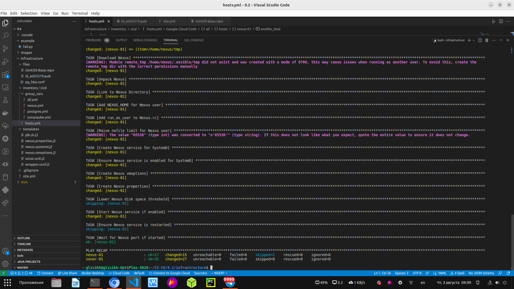

5. Проверьте готовность SonarQube через [браузер](http://localhost:9000).

Проверил готовность SonarQube в браузере:

  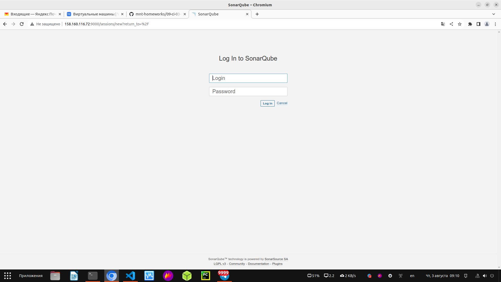

6. Зайдите под admin\admin, поменяйте пароль на свой.

Зашёл и поменял пароль на свой.

7.  Проверьте готовность Nexus через [бразуер](http://localhost:8081).

Проверил готовность Nexus через браузер

8. Подключитесь под admin\admin123, поменяйте пароль, сохраните анонимный доступ.

Подключился и поменял пароль.

## Знакомоство с SonarQube

### Основная часть

1. Создайте новый проект, название произвольное.

Создал новый проект.

2. Скачайте пакет sonar-scanner, который вам предлагает скачать SonarQube.

Скачал пакет для Linux.

3. Сделайте так, чтобы binary был доступен через вызов в shell (или поменяйте переменную PATH, или любой другой, удобный вам способ).

Сделал.

4. Проверьте `sonar-scanner --version`.

Проверил:

  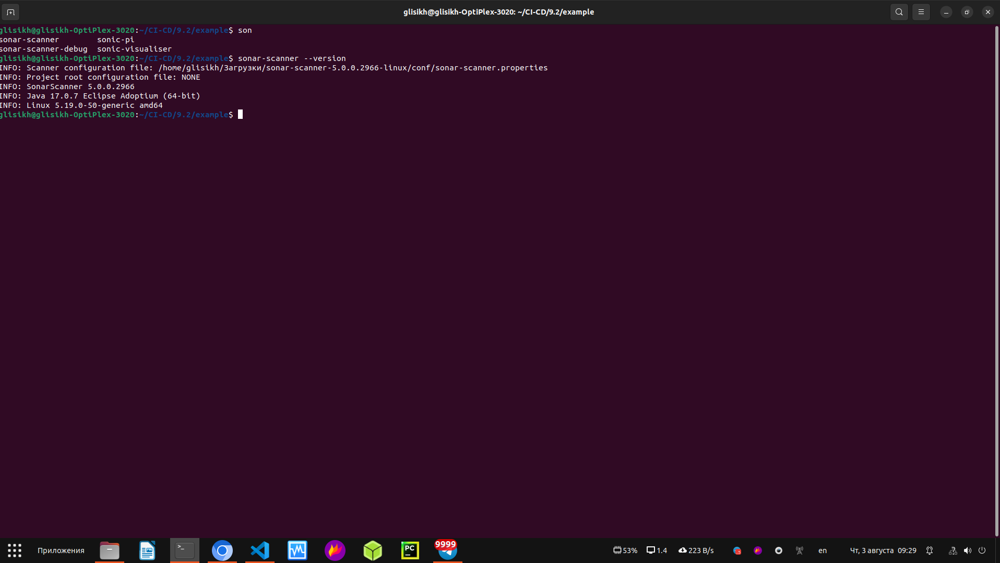

5. Запустите анализатор против кода из директории [example](./example) с дополнительным ключом `-Dsonar.coverage.exclusions=fail.py`.

Запустил анализатор кода:

  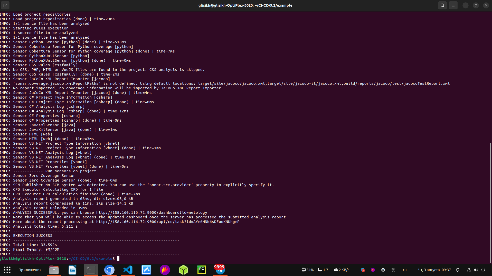

6. Посмотрите результат в интерфейсе.

Посмотрел результаты в интерфейсе:

  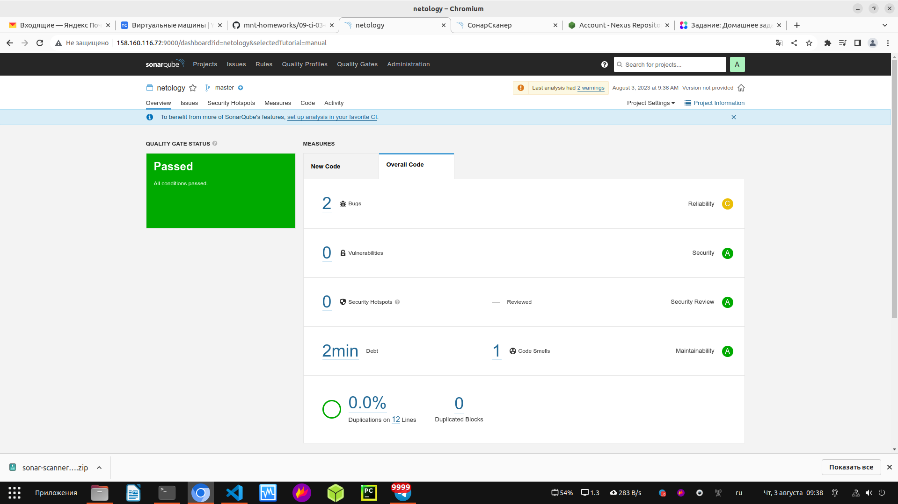

7. Исправьте ошибки, которые он выявил, включая warnings.

Исправил ошибки.

8. Запустите анализатор повторно — проверьте, что QG пройдены успешно.

Запустил анализатор повторно:

  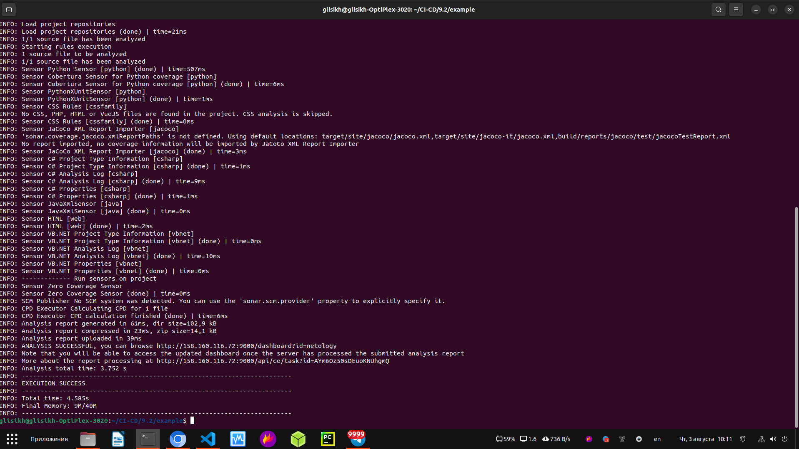

9. Сделайте скриншот успешного прохождения анализа, приложите к решению ДЗ.

  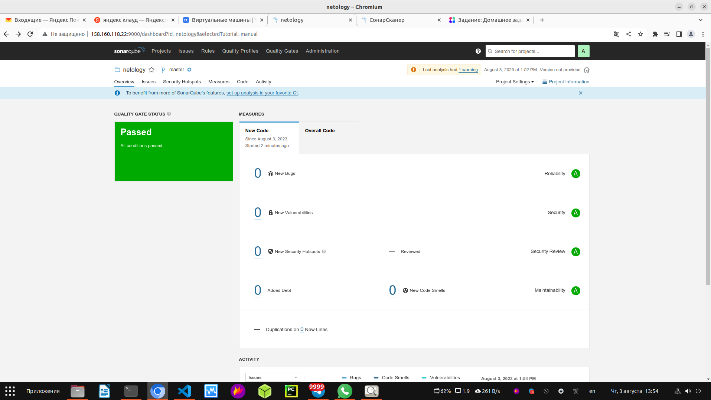

## Знакомство с Nexus

### Основная часть

1. В репозиторий `maven-public` загрузите артефакт с GAV-параметрами:

 *    groupId: netology;
 *    artifactId: java;
 *    version: 8_282;
 *    classifier: distrib;
 *    type: tar.gz.
   
Загрузил артефакт

2. В него же загрузите такой же артефакт, но с version: 8_102.

Загрузил успешно

3. Проверьте, что все файлы загрузились успешно.

Проверил, что все файлы загрузились успешно:

  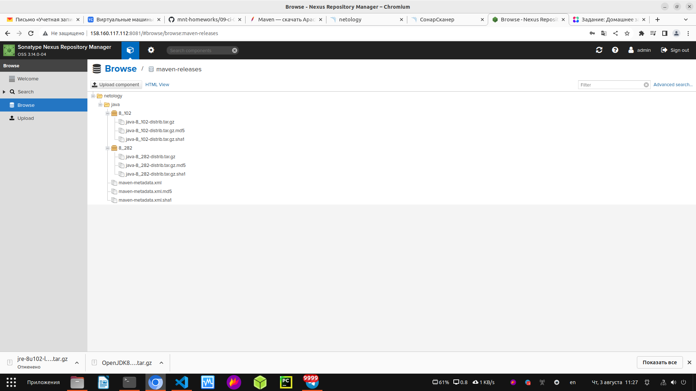

4. В ответе пришлите файл `maven-metadata.xml` для этого артефекта.

[maven-metadata.xml](https://github.com/george25031996/CI-CD/blob/main/9.2/infrastructure/files/maven-metadata.xml)

### Знакомство с Maven

### Подготовка к выполнению

1. Скачайте дистрибутив с [maven](https://maven.apache.org/download.cgi).

Скачал

2. Разархивируйте, сделайте так, чтобы binary был доступен через вызов в shell (или поменяйте переменную PATH, или любой другой, удобный вам способ).

Всё получилось сделать

3. Удалите из `apache-maven-<version>/conf/settings.xml` упоминание о правиле, отвергающем HTTP- соединение — раздел mirrors —> id: my-repository-http-unblocker.

Удалил

4. Проверьте `mvn --version`.

Проверил:

  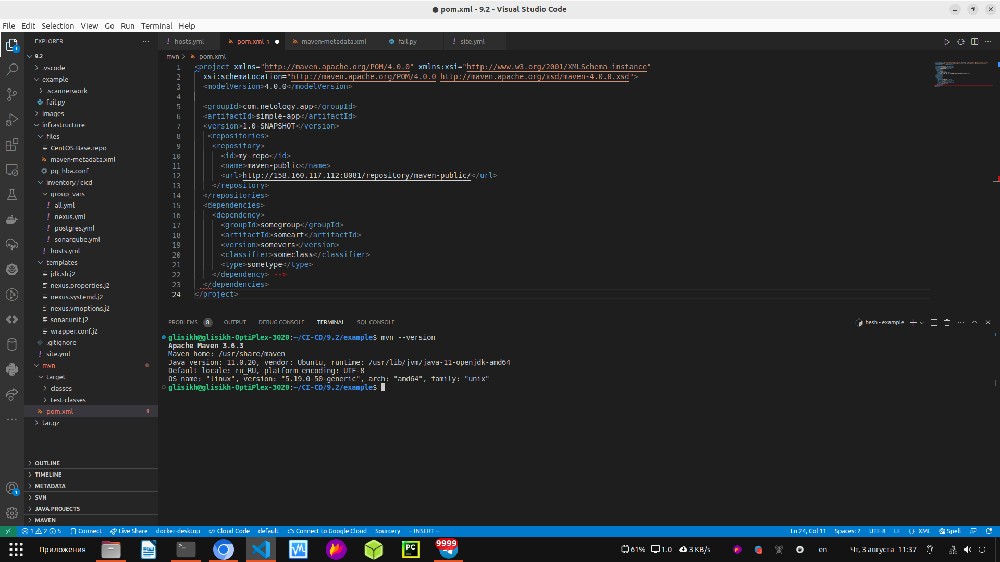

 
5. Заберите директорию [mvn](./mvn) с pom.

Забрал директорию

### Основная часть

1. Поменяйте в `pom.xml` блок с зависимостями под ваш артефакт из первого пункта задания для Nexus (java с версией 8_282).

Поменял:

  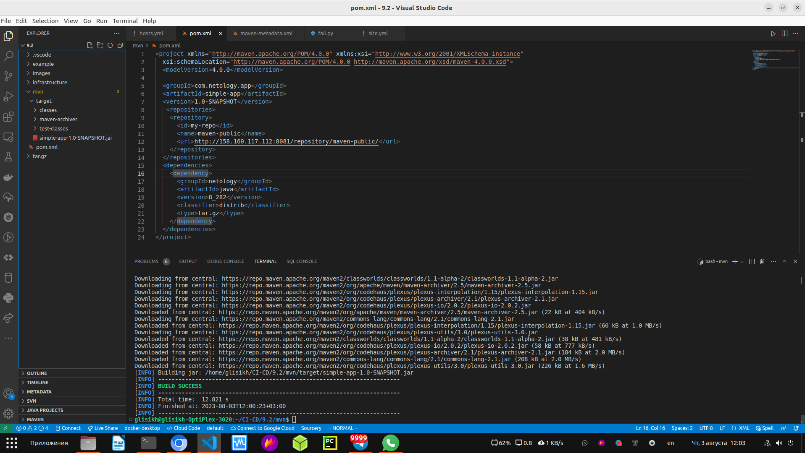

2. Запустите команду `mvn package` в директории с `pom.xml`, ожидайте успешного окончания.

Всё успешно:

  

3. Проверьте директорию `~/.m2/repository/`, найдите ваш артефакт.

  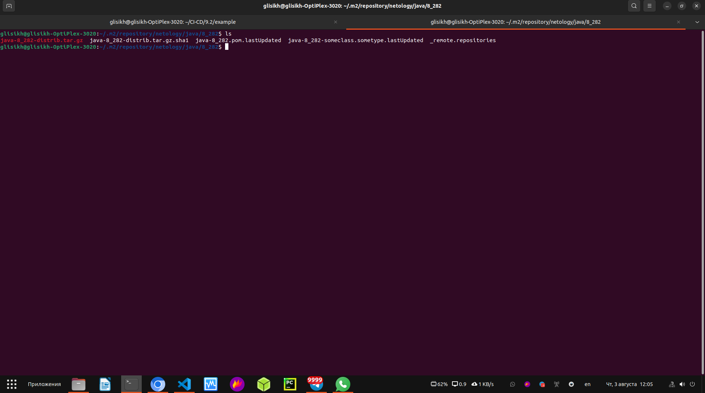

4. В ответе пришлите исправленный файл `pom.xml`.

[pom.xml](https://github.com/george25031996/CI-CD/blob/main/9.2/mvn/pom.xml)
