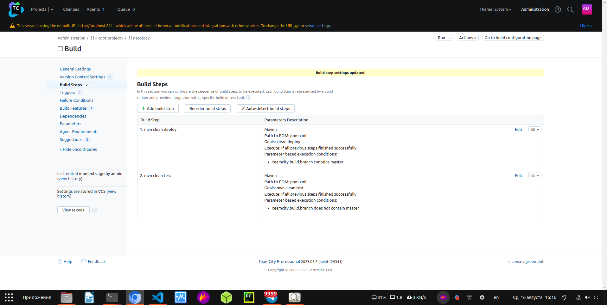

# Домашнее задание к занятию 11 «Teamcity»

## Подготовка к выполнению

1. В Yandex Cloud создайте новый инстанс (4CPU4RAM) на основе образа `jetbrains/teamcity-server`.
2. Дождитесь запуска teamcity, выполните первоначальную настройку.
3. Создайте ещё один инстанс (2CPU4RAM) на основе образа `jetbrains/teamcity-agent`. Пропишите к нему переменную окружения `SERVER_URL: "http://<teamcity_url>:8111"`.

Виртуальные машины я собрал с помощью [docker-compose.yml](https://github.com/george25031996/CI-CD/blob/main/9.5/teamcity/docker-compose.yml)

4. Авторизуйте агент.
5. Сделайте fork [репозитория](https://github.com/aragastmatb/example-teamcity).

Сделал [fork](https://github.com/george25031996/example-teamcity)

6. Создайте VM (2CPU4RAM) и запустите [playbook](./infrastructure).

## Основная часть

1. Создайте новый проект в teamcity на основе fork.

Создал новый проект в teamcity на основе fork:

  

2. Сделайте autodetect конфигурации.

Сделал autodetect конфигурации:

  

3. Сохраните необходимые шаги, запустите первую сборку master.

  

4. Поменяйте условия сборки: если сборка по ветке `master`, то должен происходит `mvn clean deploy`, иначе `mvn clean test`.

  

5. Для deploy будет необходимо загрузить [settings.xml](./teamcity/settings.xml) в набор конфигураций maven у teamcity, предварительно записав туда креды для подключения к nexus.

  

6. В pom.xml необходимо поменять ссылки на репозиторий и nexus.

Поменял

7. Запустите сборку по master, убедитесь, что всё прошло успешно и артефакт появился в nexus.

  

  

8. Мигрируйте `build configuration` в репозиторий.

  

9. Создайте отдельную ветку `feature/add_reply` в репозитории.

  

10. Напишите новый метод для класса Welcomer: метод должен возвращать произвольную реплику, содержащую слово `hunter`.

  

11. Дополните тест для нового метода на поиск слова `hunter` в новой реплике.

  

12. Сделайте push всех изменений в новую ветку репозитория.

Сделал

13. Убедитесь, что сборка самостоятельно запустилась, тесты прошли успешно.

  

  

14. Внесите изменения из произвольной ветки `feature/add_reply` в `master` через `Merge`.

Внёс изменения

15. Убедитесь, что нет собранного артефакта в сборке по ветке `master`.

  

16. Настройте конфигурацию так, чтобы она собирала `.jar` в артефакты сборки.

  

17. Проведите повторную сборку мастера, убедитесь, что сбора прошла успешно и артефакты собраны.

  

  

18. Проверьте, что конфигурация в репозитории содержит все настройки конфигурации из teamcity.

[Настройки конфигурации из teamcity](https://github.com/george25031996/example-teamcity/tree/master/.teamcity)

19. В ответе пришлите ссылку на репозиторий.

[Репозиторий example-teamcity](https://github.com/george25031996/example-teamcity)

